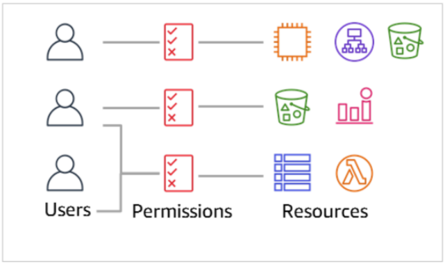
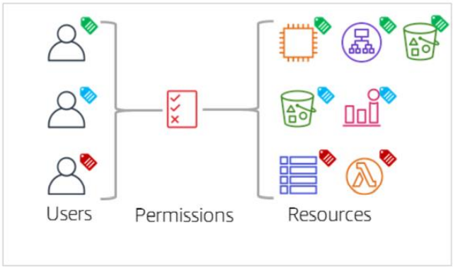

# Access Control

### Role Based Access Control

- It is a traditional approach to access control.
- In this type of access control, we grant users specific permissions based on their job requirements. Example: Database Administrator, Developers
- The person who maintains the permissions in this model might find that they must constantly update the permissions files to add access to certain roles each time a new resource is created.

### Attribute Based Access Control

- Attributes are key-value pair, such as a tag.
- Example: Team = Developer, Project = ABC
- No need to specify resources in the policy file for granting access.
- Permissions are automatically applied, based on attribute.

