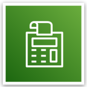

# AWS Billing and Cost Management

- AWS Billing and Cost Management is the service that you use to pay your AWS bill, monitor your usage, and budget your costs.

- From the billing dashboard, you can access several other cost management tools that you can use to estimate and plan your AWS costs.

- These tools include
    - AWS Bills,
    - AWS Cost Explorer,
    - AWS Budgets,
    - AWS Cost and Usage Reports.
