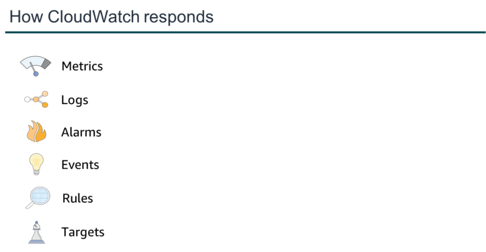
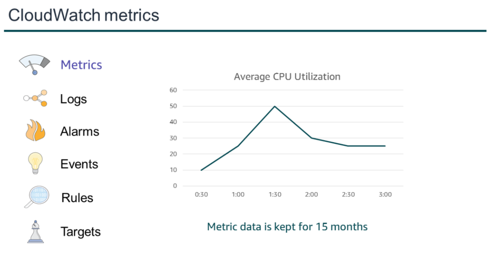
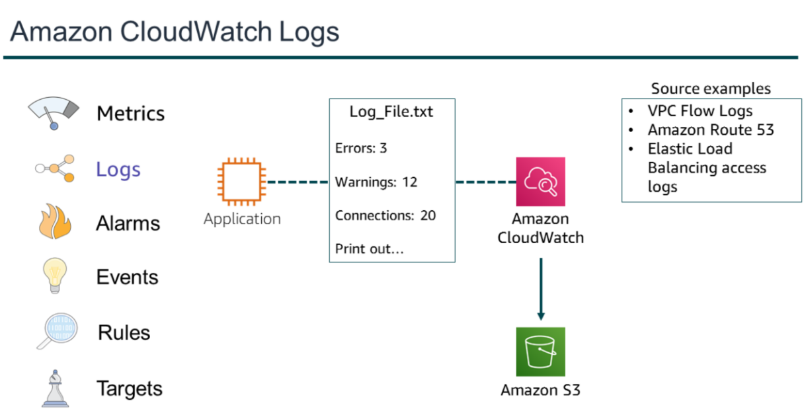
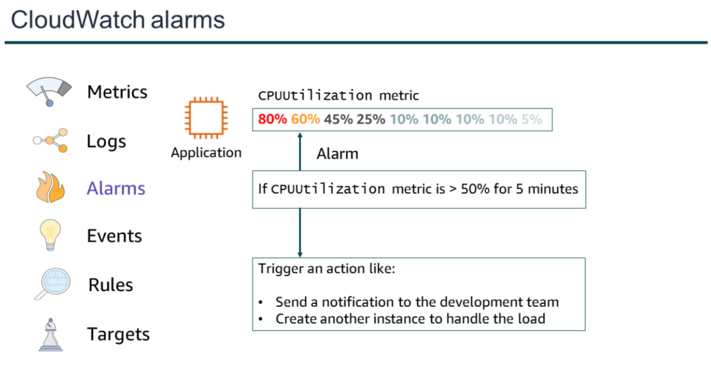
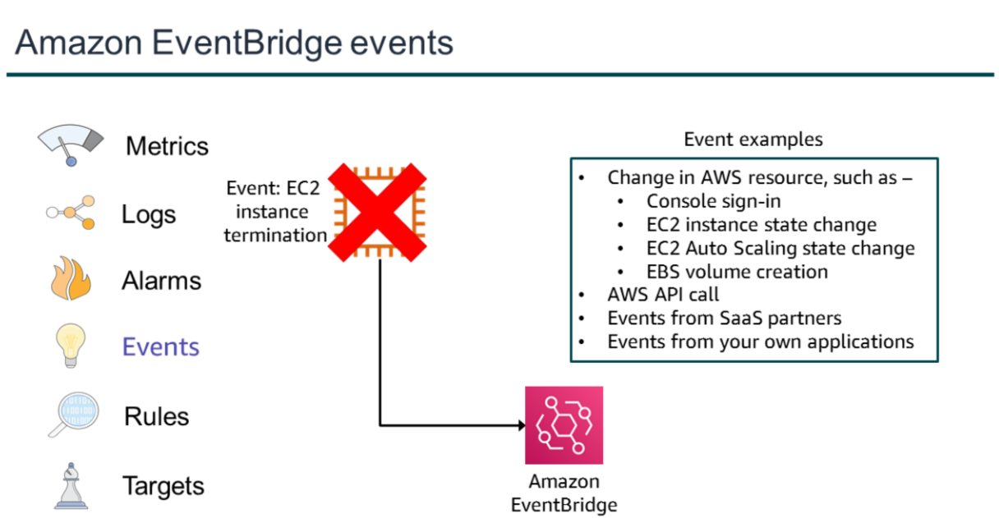
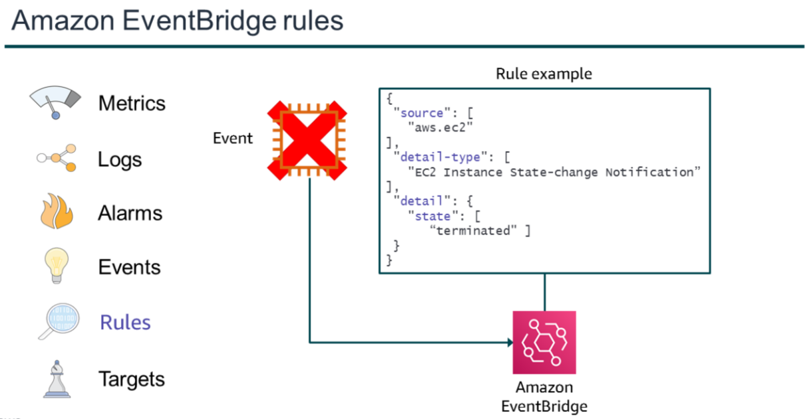
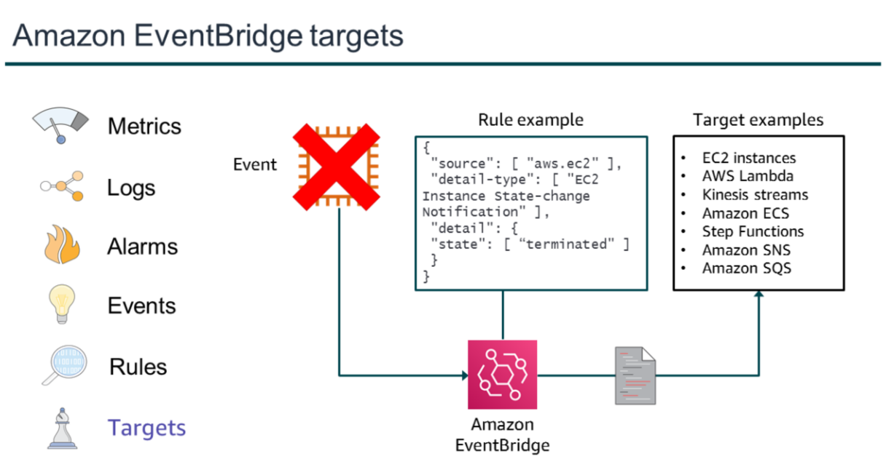

# Amazon Cloudwatch

- Amazon CloudWatch is a monitoring and observability service that is built for DevOps engineers, developers, site reliability engineers (SRE), and IT managers.

- CloudWatch monitors your AWS resources (and the applications that you run on AWS) in real time.

- You can use CloudWatch to collect and track metrics, which are variables that you can measure for your resources and
  applications.

- You can create an alarm to monitor any Amazon CloudWatch metric in your account and use the alarm to automatically send a notification to an Amazon Simple Notification Service (Amazon SNS) topic or perform an Amazon EC2 Auto Scaling or Amazon EC2 action.

