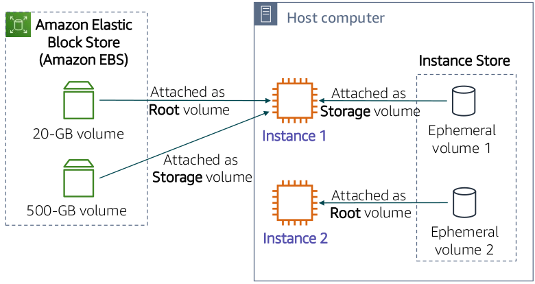

# EC2

### Categorizing Compute Services

## EC2

- It stands for Elastic Compute Cloud.

- Elastic refers to the fact that you can easily increase or decrease the number of servers you run to support an application automatically, and you can also increase or decrease the size of existing servers.

- Compute refers to reason why most users run servers in the first place, which is to host running applications or process data.

- Cloud refers to the fact that the EC2 instances that you run are hosted in the cloud.

## Launching an EC2 instance

### 1. Select an Amazon Machine Image (AMI) 

AMI provides information that is required to launch an EC2 instance. An AMI includes the following components:

- A template for the root volume of the instance. 
    - A root volume typically contains an operating system (OS) and everything that was installed in that OS (applications, libraries, etc.). 
    - Amazon EC2 copies the template to the root volume of a new EC2 instance, and then starts it.

- Launch permissions that control which AWS accounts can use the AMI.

- A block device mapping that specifies the volumes to attach to the instance (if any) when it is launched.

<b>Types of AMI</b>

1. Quick Start - pre-built AMIs from AWS for launching instances
2. My AMIs - AMIs created by us
3. AWS Marketplace - AWS Marketplace offers a digital catalog that lists thousands of software solution
4. Community AMI - These AMIs are created by people all around the world. These AMIs are not checked by AWS, so use them at your own risk.

<b> Creating a new AMI </b>

### 2. Select an Instance Type

- The instance type that you choose determines –
    - Memory (RAM)
    - Processing power (CPU)
    - Disk space and disk type (Storage)
    - Network performance

- Instance type categories –
    - General purpose
    - Compute optimized
    - Memory optimized
    - Storage optimized
    - Accelerated computing

- Instance types offer family, generation, and size

<b> Instance Type Naming and Sizes </b>

<b> Instance Type </b>

### 3. Specify Network Settings

- Identify the VPC and optionally the subnet
- To make it internet-accessible, attach public ip address

### 4. Attach IAM Role (Optional)

- Will software on the EC2 instance need to interact with other AWS services?
    - If yes, attach an appropriate IAM Role.

- You are not restricted to attaching a role only at instance
launch.
- You can also attach a role to an instance that already exists.

### 5. User Data Script (Optional)

- Optionally specify a user data script at instance launch
- Use user data scripts to customize the runtime environment of your instance
- Script runs the first time the instance starts
- Can be used strategically
- For example, reduce the number of custom AMIs that you build and maintain

### 6. Specify Storage

- When you launch an EC2 instance, you can configure storage options. 
- For example, 
    - You can configure the size of the root volume where the guest operating system is installed. 
    - You can also attach additional storage volumes when you launch the instance. 
    - Some AMIs are also configured to launch more than one storage volume by default to provide storage that is separate from the root volume.
- For each volume that your instance will have, you can specify the size of the disks, the volume types, and whether the storage will be retained if the instance is terminated. 

- You can also specify if encryption should be used.

<b>Storage Options</b>

1. Instance Store
    - An instance store volume provides temporary block-level storage for your instance. 
    - This storage is on disks that are physically attached to the computer that hosts the running instance. 
    - An instance store works well for the temporary storage of information that changes frequently, such as buffers, caches, scratch data, and other temporary content.

2. Amazon Elastic Block Store (Amazon EBS) –
    - Amazon EBS provides block-level storage volumes, similar to an external hard drive, for use with Amazon EC2 instances.
    - Amazon EBS volumes are highly available and reliable, and can be network-attached to running instances in the same Availability Zone.
    - You can stop the instance and start it again, and the data will still be there.
    - Amazon EBS volumes persist independently from the life of the instance and can be encrypted. 
    - In addition, you can back up the data on an Amazon EBS volume to Amazon S3 by taking a point-in-time snapshot.
    - Because they are mounted on the instance, EBS volumes can provide extremely low access latency. 
    - For this reason, EBS volumes can be used to run a database on an EC2 instance, for example.
    
    

3. Amazon Elastic File System (EFS)
    
    - Amazon EFS is a fully managed service that provides file system storage for Linux-based workloads. 
    - Files are accessed via a file system interface (using standard operating system file I/O APIs). 
    - They support full file system access semantics, such as strong consistency and file locking. 
    - Amazon EFS uses the Network File System (NFS) version 4.x protocol. It can be used with any AMIs that support this protocol.
    - Multiple EC2 instances can access an EFS file system at the same time. Thus, Amazon EFS can provide a common data source for workloads and applications that run on more than one Amazon EC2 instance. 
    - In addition, EFS file systems can automatically scale from gigabytes to petabytes of data without needing to provision storage.
    

### 7. Add tags

- A tag is a label that you can assign to an AWS resource.
- Consists of a key and an optional value.
- Tagging is how you can attach metadata to an EC2 instance.
- Potential benefits of tagging—Filtering, automation, cost allocation, and access control.

### 8. Security Groups

- A security group acts as a virtual firewall that controls network traffic for one or more instances.
- When you launch an instance, you can specify one or more security groups. Otherwise, the default security group is used.

### 9. Key Pair

- At instance launch, you specify an existing key pair or create a new key pair.

- A key pair consists of –
    - A public key that AWS stores.
    - A private key file that you store.

- It enables secure connections to the instance.

- For Windows AMIs –
    - Use the private key to obtain the administrator password that you need to log in to your instance.

- For Linux AMIs –
    - Use the private key to use SSH to securely connect to your instance.

### EC2 Lifecycle

