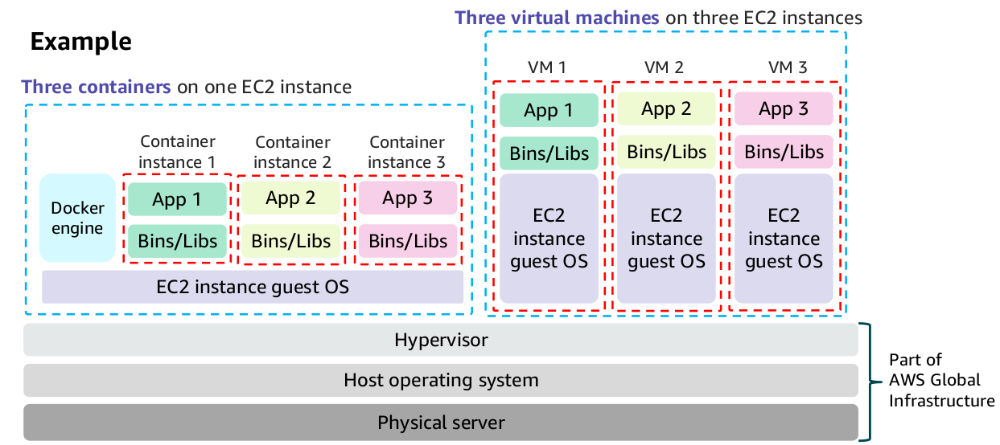

# Container Services

- Containers are a method of operating system virtualization.

- Containers are smaller than virtual machines, and do not contain an entire operating system. Instead, containers share a virtualized operating system and run as resource-isolated processes, which ensure quick, reliable, and consistent deployments.

- Containers hold everything that the software needs to run, such as libraries, system tools, code, and the runtime.

- Spinning up a container happens in hundreds of milliseconds. Thus, by using containers, you can use a fast, portable, and infrastructure-agnostic environments.

- Containers can help ensure that applications deploy quickly, reliably, and consistently, regardless of deployment environment.

## Docker

- Docker is a software platform that packages software (such as applications) into containers.

- Docker is installed on each server that will host containers, and it provides simple commands that you can use to build, start, or stop containers.

- Docker is best used as a solution when you want to:
    - Standardize environments
    - Reduce conflicts between language stacks and versions
    - Use containers as a service
    - Run microservices using standardized code deployments
    - Require portability for data processing

### Difference between Containers and Virtual Machines

- One significant difference is that virtual machines run directly on a hypervisor, but containers can run on any
  Linux OS if they have the appropriate kernel feature support and the Docker daemon is present.

- This makes containers very portable. Your laptop, your VM, your EC2 instance, and your bare metal server are all potential hosts where you can run a container.

## Kubernetes

- Kubernetes is open source software for container orchestration.

- Kubernetes can work with many containerization technologies, including Docker.

- Kubernetes enables you to deploy and manage containerized applications at scale.

- With Kubernetes, you can run any type of containerized application by using the same toolset in both on-premises data centers and the cloud.

- A key advantage of Kubernetes is that you can use it to run your containerized applications anywhere without needing to change your operational tooling. For example, applications can be moved from local on-premises development machines to production deployments in the cloud by using the same operational tooling.
