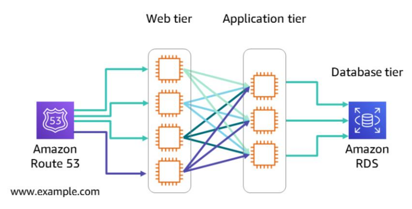
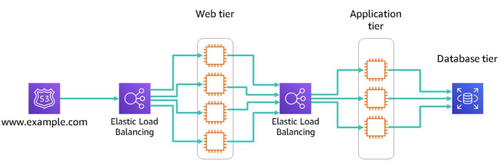
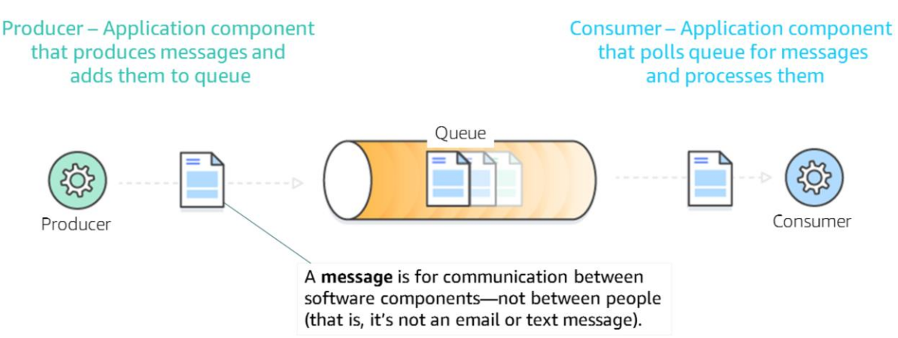
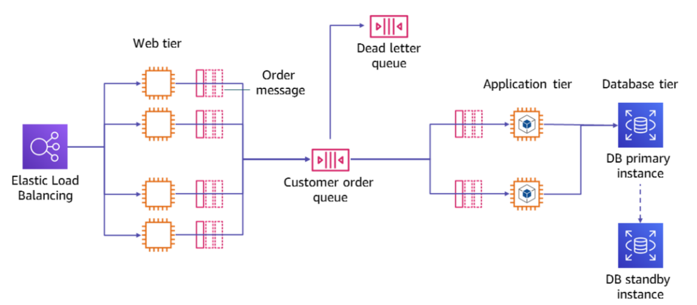
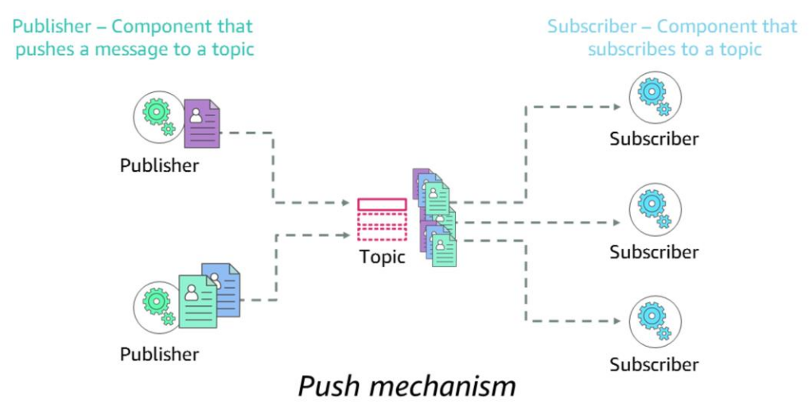
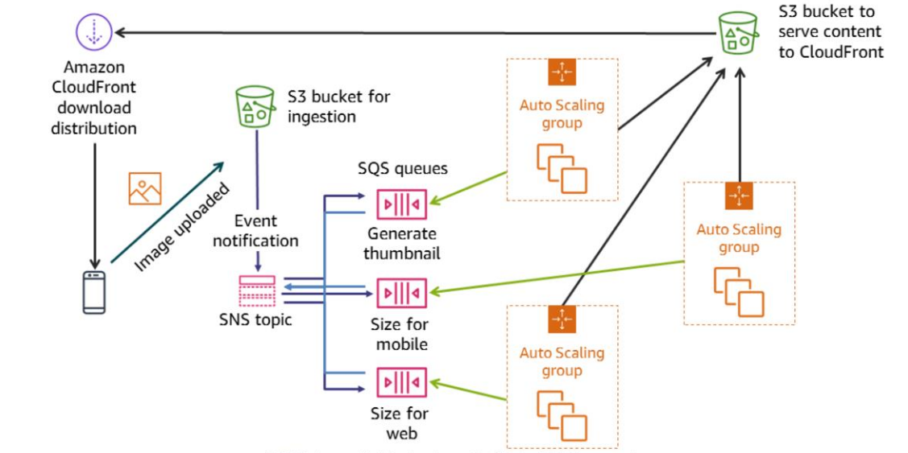
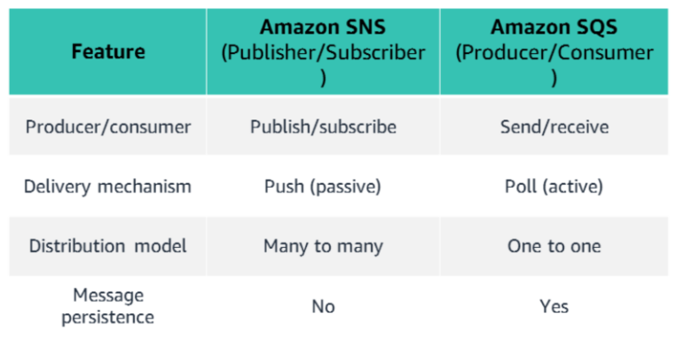
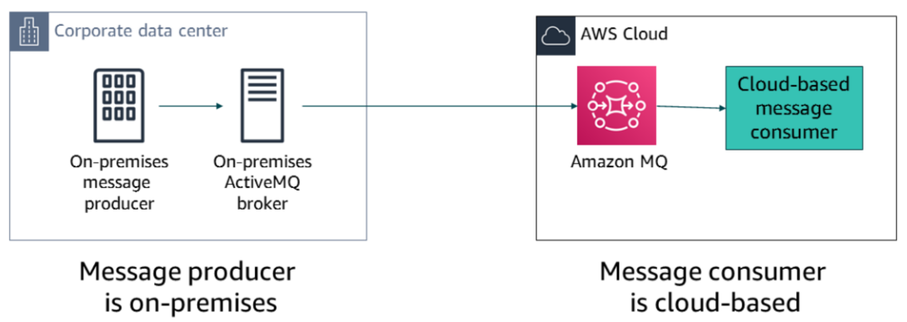
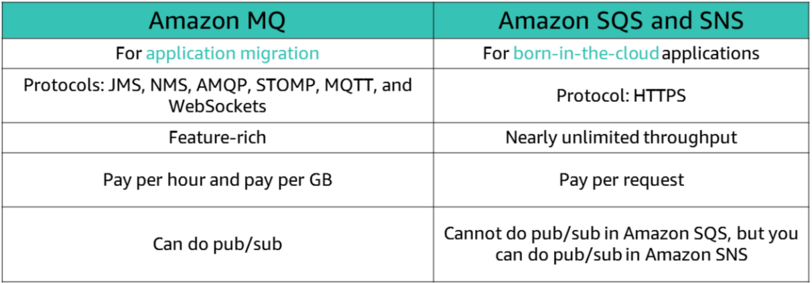

# Decoupled Architecture

### Tightly Coupled Architecture

### Loosely Coupled Architecture

### Message Queue

## Amazon Simple Queue Service (SQS)

- Amazon Simple Queue Service (Amazon SQS) is a fully managed, message queuing service that enables you to decouple application components so they run independently.

- Amazon SQS enables you to achieve loose coupling in your architecture.

    - It performs asynchronous processing so that you can get responses from each step quickly
    - It can handle performance and service requirements by increasing the number of job instances
    - Your application can easily recover from failed steps because messages will remain in the queue

- Amazon SQS can be used in many different ways:
    - Work queues – Decouple components of a distributed application that might not all process the same amount of work simultaneously.
    - Buffering batch operations – Add scalability and reliability to your architecture, and smooth out temporary volume spikes without losing messages or increasing latency.
    - Request offloading – Queue requests to move slow operations off of interactive request paths
    - Trigger Amazon EC2 Auto Scaling – Use SQS queues to help determine the load on an application. When they are combined with Amazon EC2 Auto Scaling, you can scale the number of EC2 instances out or in, depending on the volume of traffic.

### Types of Queue in SQS

There are two types of SQS queues:

1. Standard Queue Offer
    - At-least-once delivery – A message is delivered at least once, but occasionally more than one copy of a message is delivered.
    - Best-effort ordering – Occasionally, messages might be delivered in an order that is different from the order that they were sent in.
    - Nearly unlimited throughput – Standard queues support a nearly unlimited number of transactions per section (TPS) per API action.
2. First In First Out [FIFO] queues

    - Are designed to guarantee that messages are processed exactly once, in the exact order that they are sent and received.
    - Provide high throughput – FIFO queues support up to 300 messages per second (300 send, receive, or delete operations per second). When you batch 10 messages per operation (maximum), FIFO queues can support up to 3,000 messages per second.

### Features of SQS

1. Dead Letter Queue Support
    - A dead-letter queue (DLQ) is a queue of messages that could not be processed. 
    - It receives messages after the maximum number of processing attempts has been reached. 
    - A DLQ is like any other SQS queue: messages can be sent to it and received from it. 
    - You can create a DLQ from the Amazon SQS API and the console.

2. Visibility Timeout

    - Visibility timeout is the period of time when Amazon SQS prevents other consumers from receiving and processing the same message.
    - The timeout helps ensure that a job does not get processed multiple times and cause duplication.
    - During the visibility timeout, the component that received the message processes it and then deletes it from the queue. 
    - The default visibility timeout for a message is 30 seconds, and the maximum is 12 hours.
    - If the consumer fails to process and delete the message before the visibility timeout expires, the message becomee visible to other consumers and it might be processed again. 
    - Typically, you should set the visibility timeout to the maximum time that it takes your application to process and delete a message from the queue.

3. Long Poling
    - Amazon SQS supports both support short polling and long polling to retrieve messages from your SQS queues. By default, queues use short polling.
    - Short polling queries only a subset of the servers (based on a weighted random distribution) to find messages can be included in the response. 
    - Amazon SQS sends the response immediately, even if the query found no messages.
    - By contrast, long polling queries all the servers for messages. Amazon SQS sends the response after it collects the maximum number of messages for the response, or the polling wait time expires.
    - Long polling makes it inexpensive to retrieve messages from your SQS queue as soon as the messages are available. Long polling might reduce the cost of using Amazon SQS because you can reduce the number of empty receives.

### Amazon SQS Lifecycle

1. Create: First, a producer sends a message to a queue, and the message is distributed across the SQS servers redundantly.
2. Process: When a consumer is ready to process the message, it retrieves the message from the queue. While the message is being processed, it remains in the queue. During the visibility timeout, other consumers cannot process the message.
3. Delete: After processing the message, the consumer deletes the message from the queue. This action prevents the message from being received and processed again when the visibility timeout expires.

### Decoupling Example Using SQS

## Pub/Sub Messaging

- Publish/subscribe (pub/sub) messaging provides instant event notifications for distributed applications.

- The pub/sub model enables messages to be broadcast to different parts of a system asynchronously. A message topic provides a lightweight mechanism to broadcast asynchronous event notifications. 

- It also provides endpoints that enable software components to connect to the topic so that they can send and receive those messages.

- To broadcast a message, a component called a publisher pushes a message to the topic. Unlike message queues, which batch messages until they are retrieved, message topics transfer messages with no or little queuing, and push them out immediately to all subscribers. 

- A subscriber will receive every message that is broadcast, unless it sets a message filtering policy.

- The subscribers to the message topic often perform different functions, and can each do something different with the message in parallel. 
- The publisher doesn’t need to know who is using the information that it broadcasts, and the subscribers don’t need to know who the message comes from. This style of messaging is a little different from message queues, where the component that sends the message often knows the destination it is sending to.

## Amazon Simple Notification Service (SNS)

- Amazon Simple Notification Service (Amazon SNS) is a web service that you can use to set up, operate, and send notifications from the cloud. 
- The service follows the pub/sub messaging paradigm, where notifications are delivered to clients by using a push mechanism.
- Amazon SNS is designed to meet the needs of the largest and most demanding applications, and it enables
applications to publish an unlimited number of messages at any time.
- When you use Amazon SNS, you create a topic and set policies that restrict who can publish or subscribe to the topic. 
- A publisher sends messages to topics that they have either created or that they have permission to publish to. 
- Amazon SNS matches the topic to a list of subscribers who have subscribed to that topic and delivers the message to each of those subscribers. 
- Each topic has a unique name that identifies the Amazon SNS endpoint for publishers to post messages and subscribers to register for notifications. 
- Subscribers receive all messages that are published to the topics that they subscribe to, and all subscribers to a topic receive the same messages.

### Supported Transport Protocol in SNS

1. Email / Email-JSON
2. HTTP / HTTPS
3. Short Message Service (SMS)
4. Amazon SQS queues
5. AWS Lambda functions

### General Usecases of SNS

1. Application and System Alerts
2. Push email and text messaging
3. Mobile Push Notification

### Amazon SNS Considerations

1. Single Published Message
2. No recall options
3. Order and delivery not guaranteed
4. If a message cannot be successfully delivered on the first attempt, Amazon SNS uses a four-phase retry policy.

### Decoupling Example Using SNS

## SQS VS SNS

## Amazon Message Broker(MQ)

- Amazon MQ is a managed message broker service for Apache ActiveMQ that enables you to set up and operate message brokers in the cloud. 
- Message brokers enable different software systems—which often use different programming languages on different platforms—to
communicate and exchange information. 
- Amazon MQ reduces your operational load by managing the provisioning, setup, and maintenance of ActiveMQ, a popular open-source message broker.
- It supports open standard APIs and protocols for messaging, including Java Message Service (JMS), .NET Message Service (NMS), Advanced Message Queuing Protocol (AMQP), Streaming Text Oriented Messaging Protocol (STOMP), MQ Telemetry Transport (MQTT), and WebSockets.

### MQ Use Cases

### MQ VS SQS/SNS

