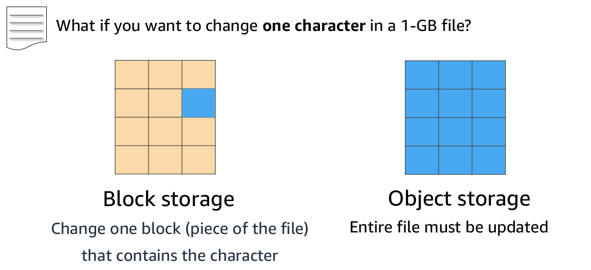
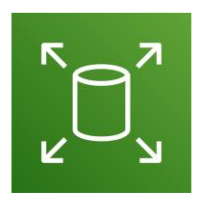

# Storage Options

## Difference between Block Storage vs Object Storage.

- With block storage, you change only the block that contains the character. With object storage, the entire file must be updated.

- This difference has a major effect on the throughput, latency, and cost of your storage solution.

- Block storage solutions are typically faster and use less bandwidth, but they can cost more than object-level storage.

## Amazon Elastic Block Store

- Amazon EBS provides persistent block storage volumes for use with Amazon EC2 instances. Persistent storage is any data storage device that retains data after power to that device is shut off.

- Each Amazon EBS volume is automatically replicated within its Availability Zone to protect you from component failure. It is designed for high availability and durability.

- Amazon EBS volumes provide the consistent and low-latency performance that is needed to run your workloads. With Amazon EBS, you can scale your usage up or down within minutes, while paying a low price for only what you provision.

- Amazon EBS enables you to create individual storage volumes and attach them to an Amazon EC2 instance. They can be used to run a database with an Amazon EC2 instance.

- Amazon EBS volumes are included as part of the backup of your instances into Amazon Machine Images (or AMIs). AMIs are stored in Amazon S3 and can be reused to create new Amazon EC2 instances later.

- You can also have encrypted Amazon EBS volumes at no additional cost, so the data that moves between the EC2 instance and the EBS volume inside AWS data centers is encrypted in transit.

### Snapshot

- A backup of an Amazon EBS volume is called a snapshot. 
- Amazon EBS enables you to back up snapshots of your data to Amazon S3 for durable recovery. If you opt for Amazon EBS snapshots, the added cost is per GB-month of data stored.
- When you copy Amazon EBS snapshots, you are charged for the data that is transferred across Regions. After the snapshot is copied, standard Amazon EBS snapshot charges apply for storage in the destination Region.
- The first snapshot is called the baseline snapshot. 
- Any other snapshot after the baseline captures only what is different from the previous snapshot.
-  You can also share snapshots or even copy snapshots to different AWS Regions for even greater disaster recovery (DR) protection. 
- For example, you can encrypt and share your snapshots from Virginia in the US to Tokyo, Japan.

### EBS Uses

- Boot volumes and storage for Amazon EC2 instances
- Data storage with a file system
- Database hosts
- Enterprise applications