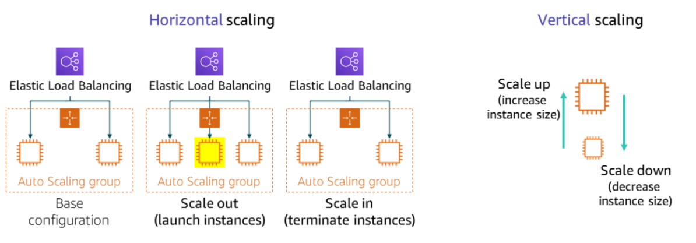
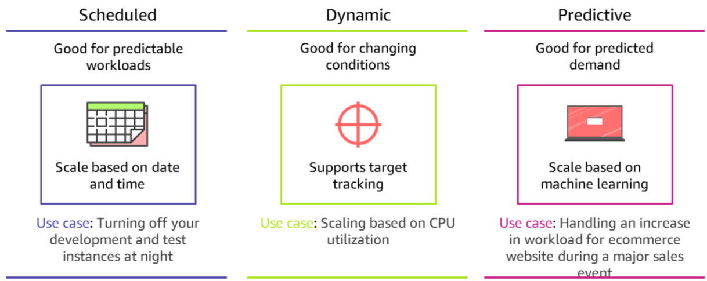

# Achieving High Elasticity

- Elasticity means that the infrastructure can expand and contract when capacity needs change.

- Scaling is a technique that is used to achieve elasticity. Scaling is the ability to increase or decrease the compute capacity of your application.

## EC2 Auto Scaling

- EC2 Auto Scaling helps you maintain application availability and enables you to automatically add or remove EC2 instances according to policies that you define, schedules, and health checks.

- If you specify scaling policies, then Amazon EC2 Auto Scaling can launch or terminate instances when demand on your application increases or decreases.

- Amazon EC2 Auto Scaling integrates with Elastic Load Balancing—it automatically registers new instances with load balancers to distribute incoming traffic across the instances.

- Amazon EC2 Auto Scaling enables you to build highly available architectures that span multiple Availability Zones in a Region.

### Scaling Options

