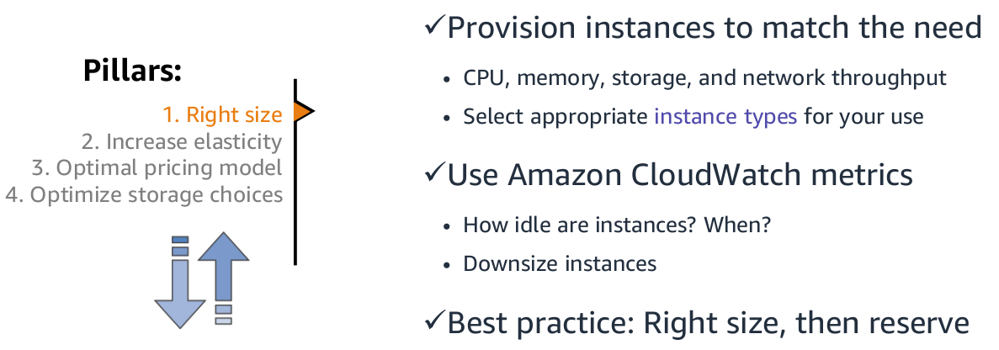
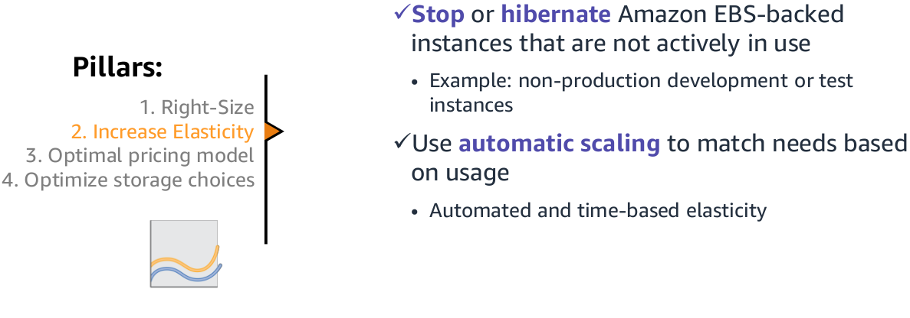
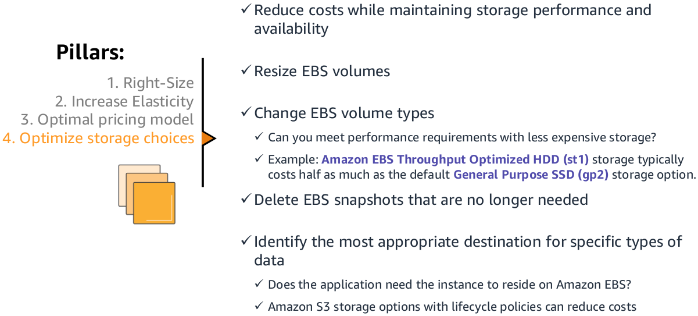

# EC2 Cost Optimization

There are four pillars of cost optimization.

### 1. Right Size

### 2. Increase Elasticity

### 3. Optimal Pricing Model

### 4. Optimize Storage Size

## Recommendations

- Define and enforce cost allocation tagging.
- Define metrics, set targets, and review regularly.
- Encourage teams to architect for cost.
- Assign the responsibility of optimization to an individual or to a team.
