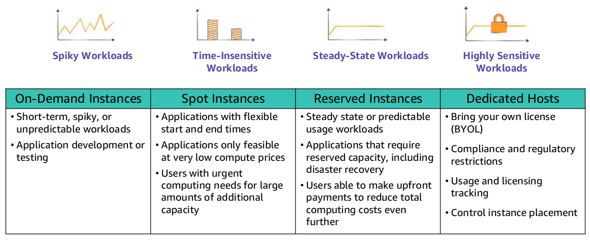

# EC2 Pricing Model

- Per second billing is only available for On-Demand Instances, Reserved Instances, and Spot Instances that run Amazon Linux or Ubuntu.

### On-Demand Instances

- Pay by hour/second.

- No long term commitments.

- It is a good choice for applications with short-term, spiky, or unpredictable workloads.

### Reserved Instances

- Full, partial, or no upfront payment for instance you can reserve for 1 or 3 year term.

- Discount on hourly charge for that instance.

### Scheduled Reserved Instances

- It enable you to purchase capacity reservations that recur on a daily, weekly, or monthly basis, with a specified duration, for a 1-year term.

- You pay for the time that the instances are scheduled, even if you do not use them.

### Spot Instances

- It enable you to bid on unused EC2 instances, which can lower your costs.

- The hourly price for a Spot Instance fluctuates depending on supply and demand.

- Your Spot Instance runs whenever your bid exceeds the current market price.

- Instances run as long as they are available and your bid is above the Spot Instance price.

- They can be interrupted (terminated, stopped or hibernated) by AWS with a 2-minute notification.

### Dedicated Host

- They are physical servers with instance capacity that is dedicated to your use.

- They enable you to use your existing per-socket, per-core, or per-VM software licenses, such as for Microsoft Windows or Microsoft SQL Server.

### Dedicated Instances

- They are physical servers with instance capacity that is dedicated to your use.

- They are physically isolated at the host hardware level from instances that belong to other AWS accounts.

## Use Cases

