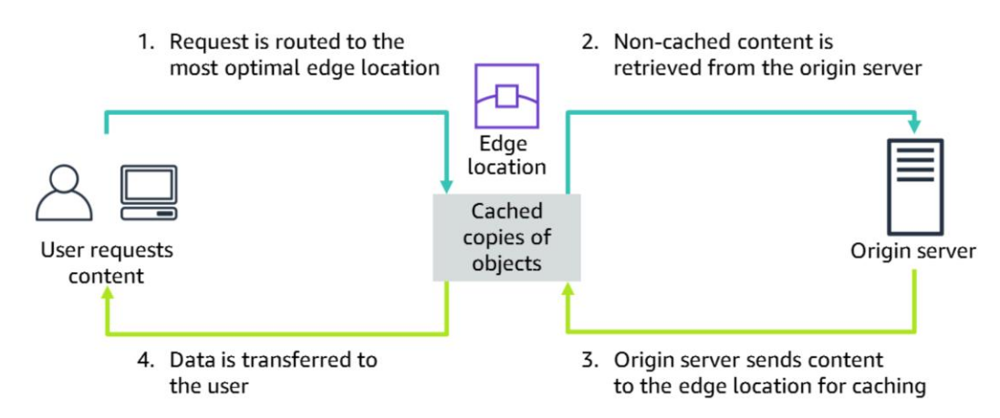
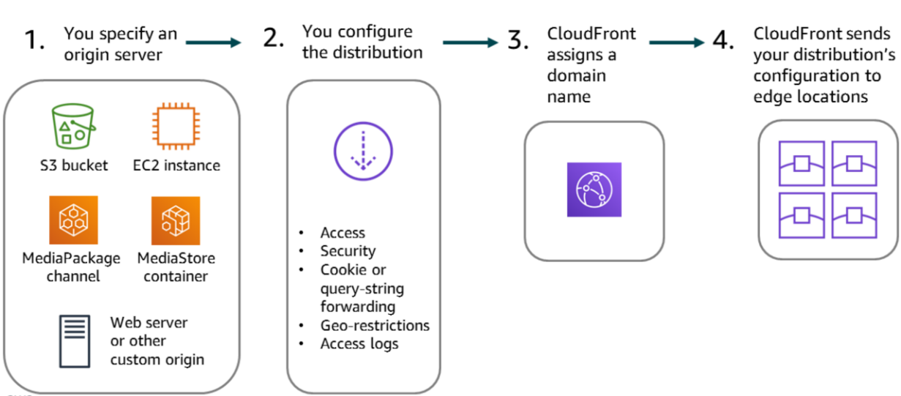
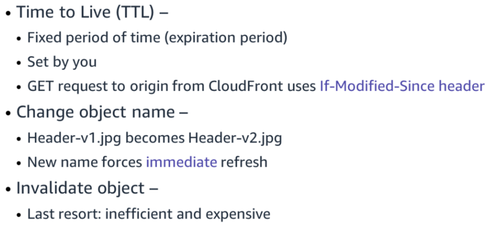
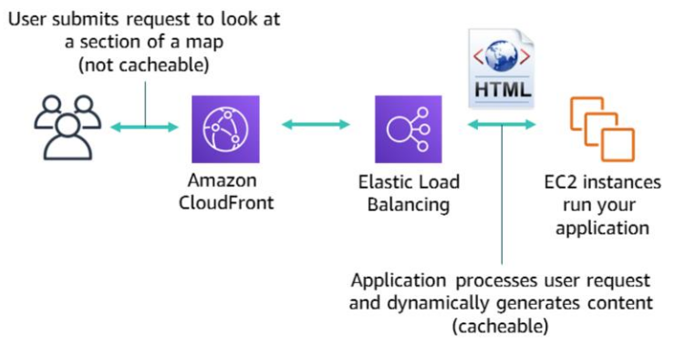

# Edge Caching

- A cache provides high throughput, low-latency access to commonly accessed application data by storing the data in memory.

- Caching can: Improve the speed of your application, Reduce the response latency that users experience with your application, Reduce application processing time and database access time for read-heavy workloads.

### CDN

- A content delivery network (CDN) is a globally distributed system of caching servers.
- A CDN caches copies of commonly requested files that are hosted on the application origin server.
- These files can include static content, such as HTML, CSS, JavaScript, image, and video files.
- The CDN delivers a local copy of the requested content from a cache edge or Point of Presence (PoP) that provides the fastest delivery to the requester.

## Amazon CloudFront

- Amazon CloudFront is a global CDN service that accelerates the delivery of content to users. Such content might be static and dynamic content, media files that use HTTP or HTTPS, and streaming video (both video on demand and live streaming).

- The CDN offers a multi-tier cache by default. Regional edge caches improve latency and lower the load on your origin servers when the object is not already cached at the edge.

- CloudFront provides both network-level and application-level protection. Your traffic and applications benefit through various built-in protections, such as AWS Shield Standard, at no extra cost. You can also use configurable features such as AWS Certificate Manager (ACM) to create and manage custom SSL certificates at no extra cost.

- CloudFront supports Secure Sockets Layer/Transport Layer Security (SSL/TLS) protocols.

- CloudFront supports real-time, bidirectional communication over the WebSocket protocol. This persistent connection enables clients and servers to send real-time data to one another without the cost of repeatedly opening connections.

- CloudFront also supports HTTP methods (DELETE, GET, HEAD, OPTIONS, PATCH POST, PUT), which improve the performance of dynamic websites.

### How caching works in Amazon CloudFront

### Configuring CloudFront

### How to expire content

### CloudFront Examples

