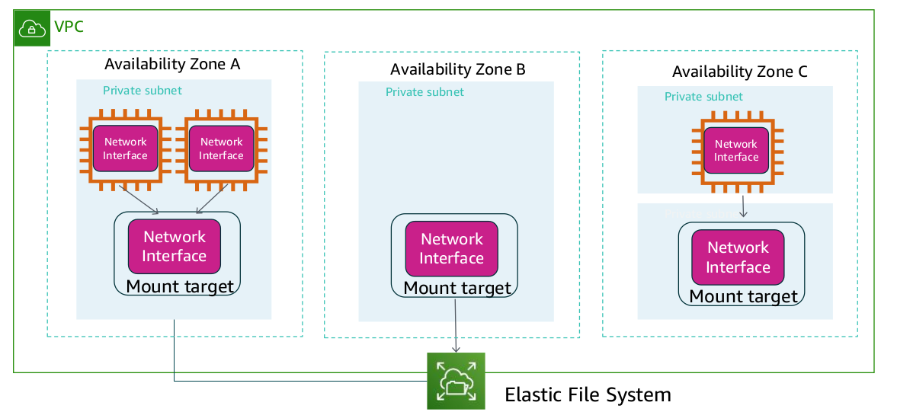

# Amazon Elastic File System (EFS)

- Amazon Elastic File System (Amazon EFS) provides simple, scalable, elastic file storage for use
  with AWS services and on-premises resources.

- It offers a simple interface that enables you to create and configure file systems quickly and easily.

- Amazon EFS is built to dynamically scale on demand without disrupting applications—it will grow and shrink automatically as you add and remove files.

- It is designed so that your applications have the storage they need, when they need it.

- You can use Amazon EFS to build a file system for big data and analytics, media processing workflows, content management, web serving, and home directories.

- You can create file systems that are accessible to Amazon EC2 instances through a file system
  interface (using standard operating system file I/O APIs).

- Amazon EFS file systems can automatically scale from gigabytes to petabytes of data without the need to provision storage.

- Thousands of Amazon EC2 instances can access an Amazon EFS file system at the same time, and Amazon EFS is designed to provide consistent performance to each Amazon EC2 instance.

- Amazon EFS is also designed to be highly durable and highly available. Amazon EFS requires no minimum fee or setup costs, and you pay only for the storage that you use.

## EFS Architecture

## EFS Setup

You must complete five steps to create and use your first Amazon EFS file system, mount it on an
Amazon EC2 instance in your VPC, and test the end-to-end setup:

1. Create your Amazon EC2 resources and launch your instance. (Before you can launch and
   connect to an Amazon EC2 instance, you must create a key pair, unless you already have one.)
2. Create your Amazon EFS file system.
3. In the appropriate subnets, create your mount targets.
4. Next, connect to your Amazon EC2 instance and mount the Amazon EFS file system.
5. Finally, clean up your resources and protect your AWS account.

## Mount Target

To access your file system, you must create mount targets in your VPC.
Each mount target has the following properties:

- The mount target ID
- The subnet ID for the subnet where it was created
- The file system ID for the file system where it was created
- An IP address where the file system can be mounted
- The mount target state
