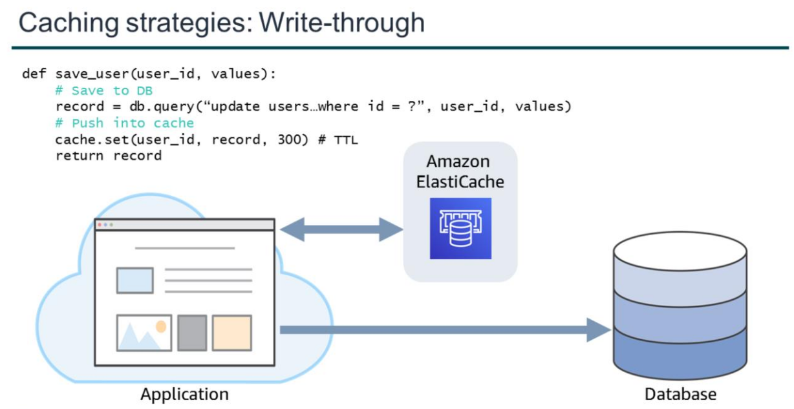

# Amazon Elastic Cache

- Amazon ElastiCache is a side cache that works as an in-memory data store to support the most demanding applications, which require sub-millisecond response times.

- ElastiCache supports two open-source in-memory databases: Redis and Memcached.

### Caching Strategy

### Difference between Redis and Memcached

### Three-Tier Web Hosting Architecture

