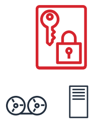
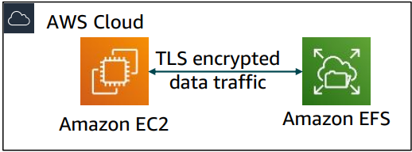

# Data Encryption in AWS

### Encryption of data at rest

- AWS supports encryption of data at rest.
- Data at rest means data stored physically (on a disk or a tape).
- AWS KMS manages encryption of secret keys.

### Encryption of data at transit

- Data at transit means data moving accross network.
- AWS Certificate Manager provides a way to manager, deploy or renew TLS or SSL certificates.

