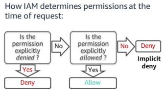
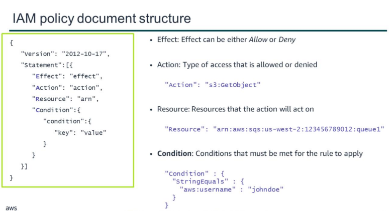

# AWS Identity and Access Management (IAM)

- It is a service that allows you configure fine-grained access control to AWS resources. 

- IAM enables security best practices by allowing you to grant unique security credentials to users and groups. 

- These credentials specify which AWS service application programming interfaces (APIs) and resources they can access.

## IAM Components

1. IAM User
2. IAM Group
3. IAM Policy
4. IAM Role

### IAM User

- A person or an application that can authenticate with an AWS account.

- They make API calls to the aws products.

### IAM Group

- A collection of IAM users that are granted identical authorizations.

-  We can use IAM groups to simplify how can we specify and manage permissions for multiple users.

### IAM Policy

- An IAM policy is a document that defines permissions to determine what users can and cannot do in the AWS account.

- Permissions are defined in IAM policy documents in the form of JSON.

- Permissions defines which resources and operations are allowed.

- BEST Practice: Follow the principle of least-privilege.

- There are two types of policies.
    - Identity Based Policy 
        - Attached to user, groups, roles
        - Types includes AWS managed, Customer managed, inline policy
    - Resource Based Policy 
        - Attached to AWS resources
        - It is always inline policy.

### IAM Role

- An IAM role is a tool for granting temporary access to specific AWS resources in an AWS account

- It is used to provide aws resources access to other aws resources.