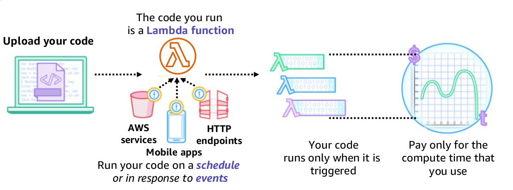

# AWS Lambda

- AWS Lambda is an event-driven, serverless compute service. 

- Lambda enables you to run code without provisioning or managing servers.

- You create a Lambda function, which is the AWS resource that contains the code that you upload. 

- You then set the Lambda function to be triggered, either on a scheduled basis or in response to an event. Your code only runs when it is triggered.

- You pay only for the compute time you consume—you are not charged when your code is not running.

- Benefits:
    - It supports multiple programming languages
    - Completely automated administration
    - Built-in fault tolerance
    - It supports the orchestration of multiple functions
    - Pay-per-use pricing

