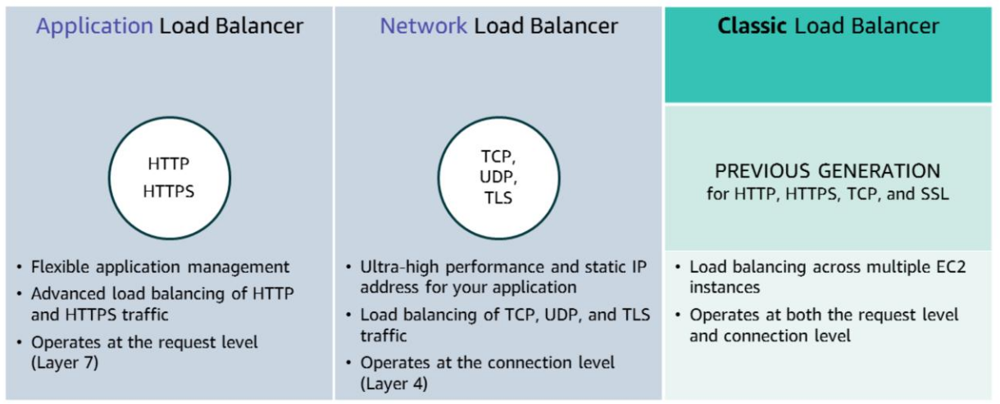
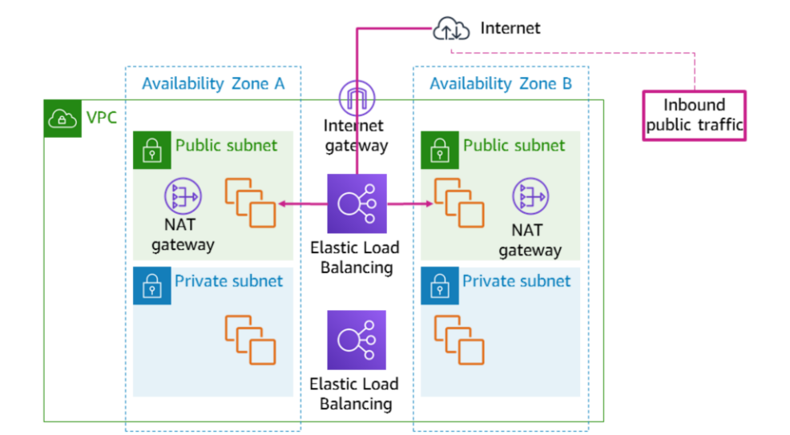

# Designing Highly Available System

- A highly available system is one that can withstand some measure of degradation while remaining available.

- In a highly available system, downtime is minimized as much as possible, and minimal human intervention is required.

## Elastic Load Balancing

- Elastic Load Balancing is a key component of creating a highly available architecture.

- ELB automatically distributes incoming application traffic across multiple targets, such as EC2 instances, containers, IP addresses, and Lambda functions.

- It can handle the varying load of your application traffic in a single Availability Zone or across multiple Availability Zones.

### Load Balancer Monitoring

You can use the following features to monitor your load balancers, analyze traffic patterns, and troubleshoot issues with your load balancers and targets:

1. Amazon CloudWatch metrics
2. Access logs
3. AWS CloudTrail logs

### Types of Load Balancer

### Example Architecture

### Use Cases

