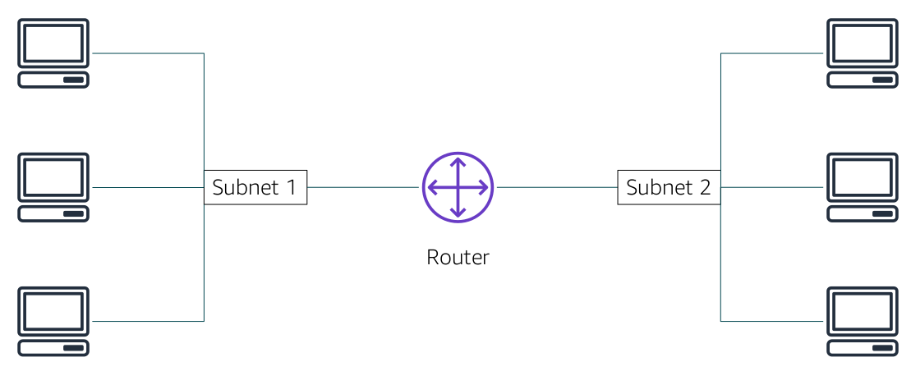
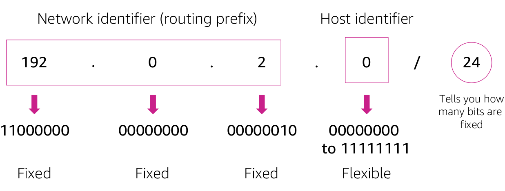

# Networking Basics

- A computer network is two or more client machines that are connected together to share resources.
- A network can be logically partitioned into subnets.

---

### IP Address

- Each client machine in a network has a unique Internet Protocol (IP) address that identifies it.
- A 32-bit IP address is called an IPv4 address. Example: 192.0.2.0
- A 128-bit IP address is called an IPv6 address. Example: 2600:1f18:22ba:8c00:ba86:a05e:a5ba:00FF

---

### Classless Inter-Domain Routing (CIDR)

- In this example, the CIDR address is 192.0.2.0/24.

    - The last number (24) tells you that the first 24 bits must be fixed.
    - The last 8 bits are flexible, which means that 2^8 (or 256) IP addresses are available for the network, which range from 192.0.2.0 to 192.0.2.255.
    - The fourth decimal digit is allowed to change from 0 to 255.

- If the CIDR was 192.0.2.0/16,
    - the last number (16) tells you that the first 16 bits must be fixed.
    - The last 16 bits are flexible, which means that 2^16 (or 65,536) IP addresses are available for the network, ranging from 192.0.0.0 to 192.0.255.255.
    - The third and fourth decimal digits can each change from 0 to 255.

---

### Special Cases

- Fixed IP addresses, in which every bit is fixed, represent a single IP address (for example, 192.0.2.0/32). This type of address is helpful when you want to set up a firewall rule and give access to a specific host.

- The internet, in which every bit is flexible, is represented as 0.0.0.0/0