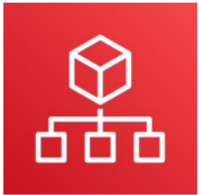

# AWS Organization

- AWS Organizations is a free account management service that enables you to consolidate multiple AWS accounts into an organization that you create and centrally manage.

- The main benefits of AWS Organizations are:
    - Centrally managed access policies across multiple AWS accounts.
    - Controlled access to AWS services.
    - Automated AWS account creation and management.
    - Consolidated billing across multiple AWS accounts.

- The diagram shows a basic organization, or root, that consists of seven accounts that are organized into four organizational units (or OUs). An OU is a container for accounts within a root.

- An OU can also contain other OUs. This structure enables you to create a hierarchy that looks like an upside-down tree with the root at the top.

- The branches consist of child OUs and they move downward until they end in accounts, which are like the leaves of the tree.

- When you attach a policy to one of the nodes in the hierarchy, it flows down and it affects all the branches and leaves. This example organization has several policies that are attached to some of the OUs or are attached directly to accounts.

- An OU can have only one parent and, currently, each account can be a member of exactly one OU. An account is a standard AWS account that contains your AWS resources.

- You can attach a policy to an account to apply controls to only that one account
