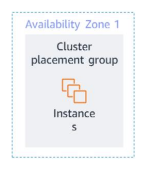
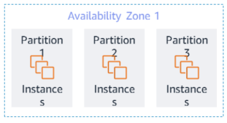
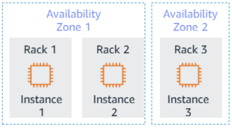

# Placement Group

When you launch a new EC2 instance, the default behavior of Amazon EC2 is to minimize correlated failures by spreading out new instances across underlying hardware.

You can use placement groups to influence the placement of a group of interdependent instances so they meet the needs of your workload.

Depending on the type of workload, you can create a placement group by using one of the following placement strategies:

## 1. Cluster

- Packs instances close together inside an Availability Zone. This strategy enables workloads to achieve low-latency network performance.

- AWS recommends that you launch all the instances that you need in a cluster grouping all at once in a single launch request.

- If you try to add more instances to the group later, you increase your chances of receiving an insufficient capacity error.

## 2. Partition

- Partition placement groups help reduce the likelihood of correlated hardware failures for your application.

- When you use partition placement groups, Amazon EC2 divides each group into logical segments that are called partitions.

- Amazon EC2 ensures that each partition in a placement group has its own set of racks. Each rack has its own network and power source.

- No two partitions in a placement group share the same racks, so you can isolate the impact of
  hardware failure in your application.

- A partition placement group can have partitions in multiple Availability Zones in the same Region.

- A partition placement group can have a maximum of seven partitions per Availability Zone.

## 3. Spread

- A spread placement group is a grouping of instances that are purposely positioned on distinct underlying hardware.

- This grouping reduces the risk of simultaneous failures that could occur if instances shared underlying hardware.

- This type of group can span multiple Availability Zones, up to a maximum of seven instances per Availability Zone per group.

- Spread placement groups are recommended for applications that have a small number of critical instances that should be kept separate from each other.

