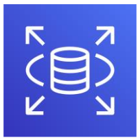
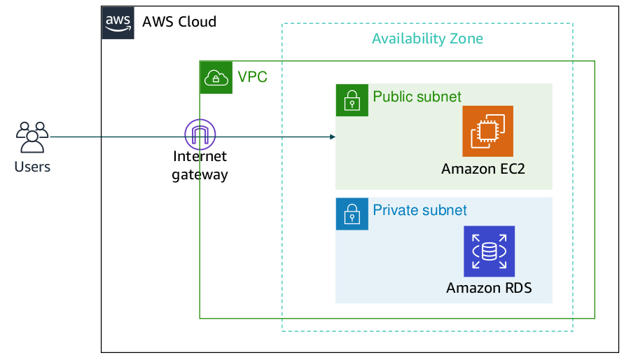
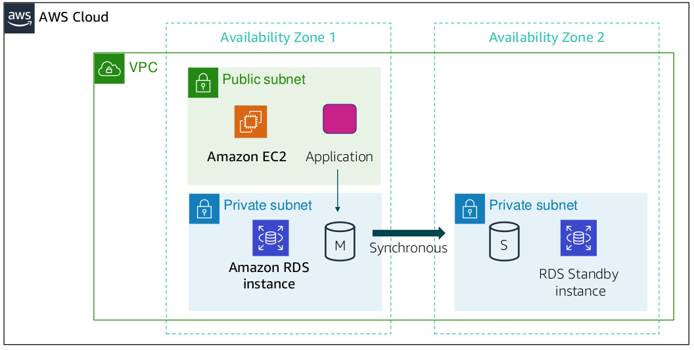

# Amazon Relational Database Service

- Amazon RDS is a managed service that sets up and operates a relational database in the cloud.

- Amazon RDS enables you to focus on your application, so you can give applications the performance, high availability, security, and compatibility that they need. With Amazon RDS, your primary focus is your data and optimizing your application.

- The basic building block of Amazon RDS is the database instance. A database instance is an isolated database environment that can contain multiple user-created databases. It can be accessed by using the same tools and applications that you use with a standalone database instance.

- The resources in a database instance are determined by its database instance class, and the type of storage is dictated by the type of disks. Database instances and storage differ in performance characteristics and price, which enable you to customize your performance and cost to the needs of your database.

- When you choose to create a database instance, you must first specify which database engine to run. Amazon RDS currently supports six databases: MySQL, Amazon Aurora, Microsoft SQL Server, PostgreSQL, MariaDB, and Oracle.

## High availability with multi availability zone deployment

- After a Multi-AZ deployment is configured, Amazon RDS automatically generates a standby copy of the database instance in
  another Availability Zone within the same VPC.

- After seeding the database copy, transactions are synchronously replicated to the standby copy.

- Therefore, if the main database instance fails in a Multi-AZ deployment, Amazon RDS automatically brings the standby database instance online as the new main instance.

- The synchronous replication minimizes the potential for data loss. Because your applications reference the database by name by using the Amazon RDS Domain Name System (DNS) endpoint, you don't need to change anything in your application code to use the standby copy for failover.

## RDS vs NoSQL

Use Amazon RDS when your application requires:

- Complex transactions or complex queries
- A medium to high query or write rate – up to 30,000 IOPS (15,000 reads + 15,000 writes)
- No more than a single worker node or shard
- High durability

Do not use Amazon RDS when your application requires:

- Massive read/write rates (for example 150,000 writes per second)
- Sharding due to high data size or throughput demands
- Simple GET or PUT requests and queries that a NoSQL database can handle
- Or, relational database management system (RDBMS) customization

### RDS Cost

- When you begin to estimate the cost of Amazon RDS, you must consider the clock hours of service time, which are resources that incur charges when they are running (for example, from the time you launch a database instance until you terminate the instance).

- Database characteristics should also be considered. The physical capacity of the database you choose will affect how much you are charged.

- Database characteristics vary depending on the database engine, size, and memory class.

### RDS Backup Storage

- Consider provisioned storage. There is no additional charge for backup storage of up to 100 percent of your provisioned database storage for an active database instance.

- After the database instance is terminated, backup storage is billed per GB, per month.
