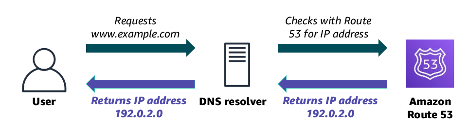

# Amazon Route 53

- Amazon Route 53 is a highly available and scalable cloud Domain Name System (DNS) web service.

- It is used to route end users to internet applications by translating names (like www.example.com) into numeric IP addresses (like 192.0.2.1) that computers use to connect to each other.

- It is fully compliant with IPv4 and IPv6.

- Connects user requests to infrastructure running in AWS and also outside of AWS.

- It is also used to check the health of your resources.

- Amazon Route 53 traffic flow helps you manage traffic globally through several routing types, which can be combined with DNS failover to enable various low-latency, fault-tolerant architectures.

---

### DNS Resolution

---

### Supported Routing

1. Simple routing – Use in single-server environments.

2. Weighted round robin routing – Assign weights to resource record sets to specify the frequency.

3. Latency routing – Help improve your global applications.

4. Geolocation routing – Route traffic based on location of your users.

5. Geoproximity routing – Route traffic based on location of your resources.

6. Failover routing – Fail over to a backup site if your primary site becomes unreachable.

7. Multivalue answer routing – Respond to DNS queries with up to eight healthy records selected at random.

---

### AWS Multi-Region Deployment

---

### DNS Failover

Amazon Route 53 enables you to improve the availability of your applications that run on AWS by:

- Configuring backup and failover scenarios for your own applications.
- Enabling highly available multi-Region architectures on AWS.
- Creating health checks to monitor the health and performance of your web applications, web servers, and other resources.
