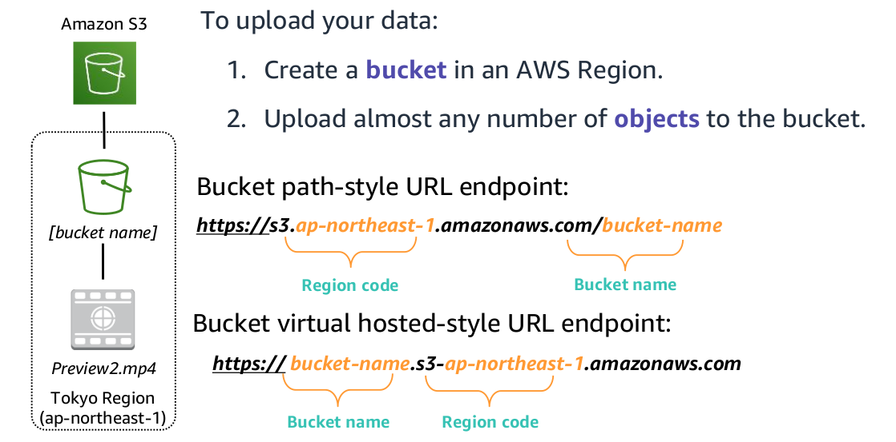
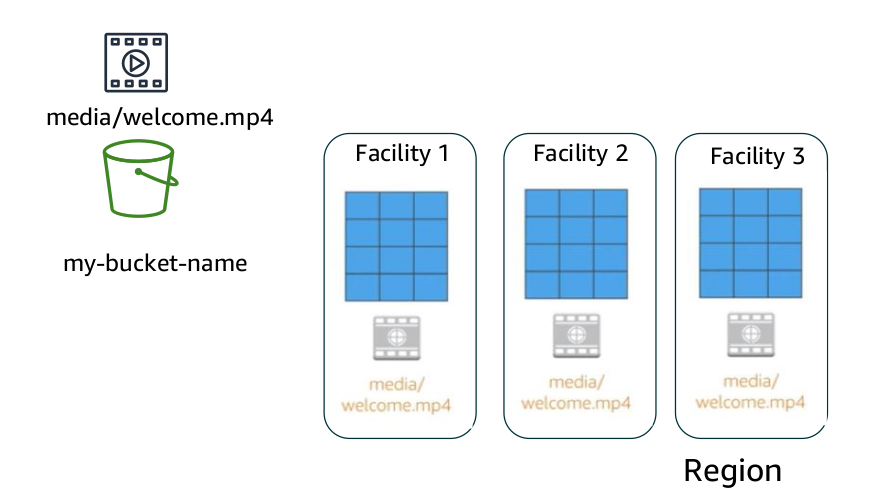
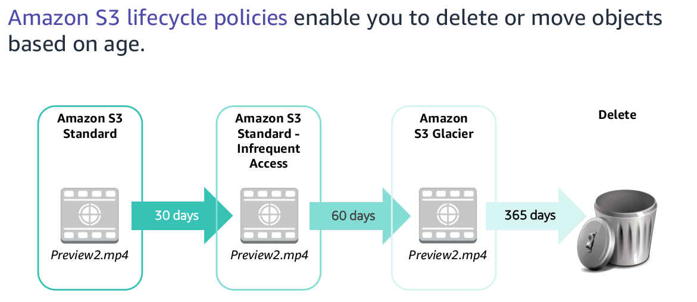

# AWS S3

## Introduction

- Amazon S3 is object-level storage, which means that if you want to change a part of a file, you
  must make the change and then re-upload the entire modified file.

- Amazon S3 stores data as objects within resources that are called buckets.

- Objects can be almost any data file, such as images, videos, or server logs.

- By default, none of your data is shared publicly. You can also encrypt your data in transit and
  choose to enable server-side encryption on your objects.

- Amazon S3 includes event notifications that enable you to set up automatic notifications when
  certain events occur.

- With storage class analysis, you can analyze storage access patterns and transition the right data to
  the right storage class.

- The Amazon S3 Analytics feature automatically identifies the optimal lifecycle policy to transition less frequently accessed storage to Amazon S3 Standard – Infrequent Access (Amazon S3 Standard-IA).

- You can configure a storage class analysis policy to monitor an entire bucket, a prefix, or an object tag.

- When an infrequent access pattern is observed, you can easily create a new lifecycle age policy that
  is based on the results.

- Amazon S3 automatically manages the storage behind your bucket while your data grows. You can get started immediately, and your data storage will grow with your application needs. Amazon S3 also scales to handle a high volume of requests.

- You do not need to provision the storage or throughput, and you are billed only for what you use.

- With Amazon S3, specific costs vary depending on the Region and the specific requests that were made.

- You pay only for what you use, including gigabytes per month; transfer out of other
  Regions; and PUT, COPY, POST, LIST, and GET requests.

- As a general rule, you pay only for transfers that cross the boundary of your Region, which means you do not pay for transfers in to Amazon S3 or transfers out from Amazon S3 to Amazon CloudFront edge locations within that same Region.

## Use Cases

- Backup and storage – Provide data backup and storage services for others
- Application hosting – Provide services that deploy, install, and manage web applications
- Media hosting – Build a redundant, scalable, and highly available infrastructure that hosts video,
  photo, or music uploads and downloads
- Software delivery – Host your software applications that customers can download

## Storage Classes

Amazon S3 offers a range of object-level storage classes that are designed for different use cases.

### Amazon S3 Standard

- Amazon S3 Standard is designed for high durability, availability, and performance object storage for frequently accessed data.

- Because it delivers low latency and high throughput, Amazon S3 Standard is appropriate for a variety of use cases, including cloud applications, dynamic websites, content distribution, mobile and gaming applications, and big data analytics.

### Amazon S3 Intelligent-Tiering

- The Amazon S3 Intelligent-Tiering storage class is designed to optimize costs by automatically moving data to the most cost-effective access tier, without performance impact or operational overhead.

- For a small monthly monitoring and automation fee per object, Amazon S3 monitors access patterns of the objects in Amazon S3 Intelligent- Tiering, and moves the objects that have not been accessed for 30 consecutive days to the infrequent access tier.

- If an object in the infrequent access tier is accessed, it is automatically moved back to the frequent access tier. There are no retrieval fees when you use the Amazon S3 Intelligent-Tiering storage class, and no additional fees when objects are moved between access tiers. It works well for long-lived data with access patterns that are unknown or unpredictable.

### Amazon S3 Standard-Infrequent Access (Amazon S3 Standard-IA)

- The Amazon S3 Standard- IA storage class is used for data that is accessed less frequently, but requires rapid access when needed.

- Amazon S3 Standard-IA is designed to provide the high durability, high throughput, and low latency of Amazon S3 Standard, with a low per-GB storage price and per-GB retrieval fee.

- This combination of low cost and high performance makes Amazon S3 Standard-IA good for long-term storage and backups, and as a data store for disaster recovery files.

### Amazon S3 One Zone-Infrequent Access (Amazon S3 One Zone-IA)

- Amazon S3 One Zone-IA is for data that is accessed less frequently, but requires rapid access when needed.

- Unlike other Amazon S3 storage classes, which store data in a minimum of three Availability Zones,
  Amazon S3 One Zone-IA stores data in a single Availability Zone and it costs less than Amazon S3
  Standard-IA.

- Amazon S3 One Zone-IA works well for customers who want a lower-cost option for infrequently accessed data, but do not require the availability and resilience of Amazon S3 Standard or Amazon S3 Standard-IA.

- It is a good choice for storing secondary backup copies of on-premises data or easily re-creatable data.

- You can also use it as cost-effective storage for data that is replicated from another AWS Region by using Amazon S3 Cross-Region Replication.

### AWS Glacier

- Amazon S3 Glacier is a secure, durable, and low-cost storage class for data archiving.

- You can reliably store any amount of data at costs that are competitive with—or cheaper than—on-premises solutions.

- To keep costs low yet suitable for varying needs, Amazon S3 Glacier provides three retrieval options that range from a few minutes to hours.

- You can upload objects directly to Amazon S3 Glacier, or use Amazon S3 lifecycle policies to transfer data between any of the Amazon S3 storage classes for active data.

### Amazon S3 Glacier Deep Archive

- Amazon S3 Glacier Deep Archive is the lowest-cost storage class for Amazon S3.

- It supports long-term retention and digital preservation for data that might be accessed once or twice in a year.

- It is designed for customers — particularly customers in highly regulated industries, such as financial services, healthcare, and public sectors — that retain datasets for 7–10 years (or more) to meet regulatory compliance requirements.

- Amazon S3 Glacier Deep Archive can also be used for backup and disaster recovery use cases.

- All objects that are stored in Amazon S3 Glacier Deep Archive are replicated and stored across at least three geographically dispersed Availability Zones, and these objects can be restored within 12 hours.

## S3 Bucket

- When you create a bucket in Amazon S3, it is associated with a specific AWS Region.

- When you store data in the bucket, it is redundantly stored across multiple AWS facilities within your selected Region.

- Amazon S3 is designed to durably store your data, even if there is concurrent data loss in two AWS facilities.

## S3 Lifecycle Policies

