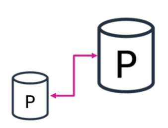
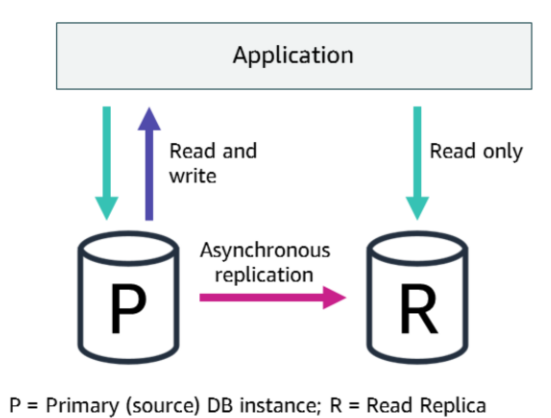

# Scaling Database

- As a managed service, Amazon Relational Database Service (Amazon RDS) scales your relational database so that it can keep up with the increasing demands of your application.

## Vertical Scaling

- You can vertically scale your Amazon RDS database (DB) instance by changing the Amazon RDS instance class.

- If you decide to scale the compute resources that are available to your DB instance up or down, be aware that your database is temporarily unavailable while the DB instance class is modified.

- This period of unavailability typically lasts only a few minutes. It occurs during the maintenance window for your DB instance, unless you specify that the modification should be applied immediately.

## Horizontal Scaling

- In addition to vertical scaling, you can scale your database horizontally.

- Amazon RDS uses the MariaDB, MySQL, Oracle, and PostgreSQL DB engines' built-in replication functionality to create a special type of DB instance called a read replica from a source DB instance.

- Updates that are made to the source DB instance are asynchronously copied to the read replica.

- You can reduce the load on your source DB instance by routing read queries from your applications to the read replica.

### Horizontal Scaling - Sharding

- Sharding, also known as horizontal partitioning, is a popular scale-out approach for relational databases that improves write performance.

- Sharding is a technique that splits data into smaller subsets and distributes them across a number of physically separated database servers. Each server is referred to as a database shard.
