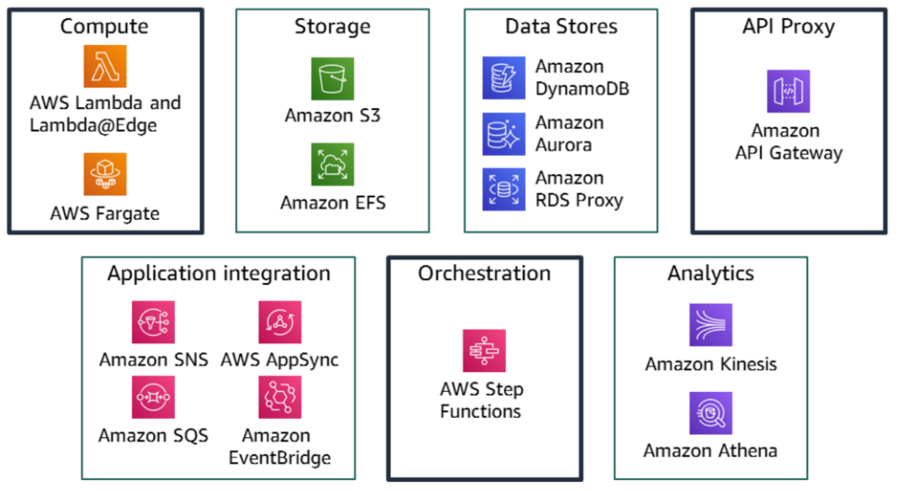
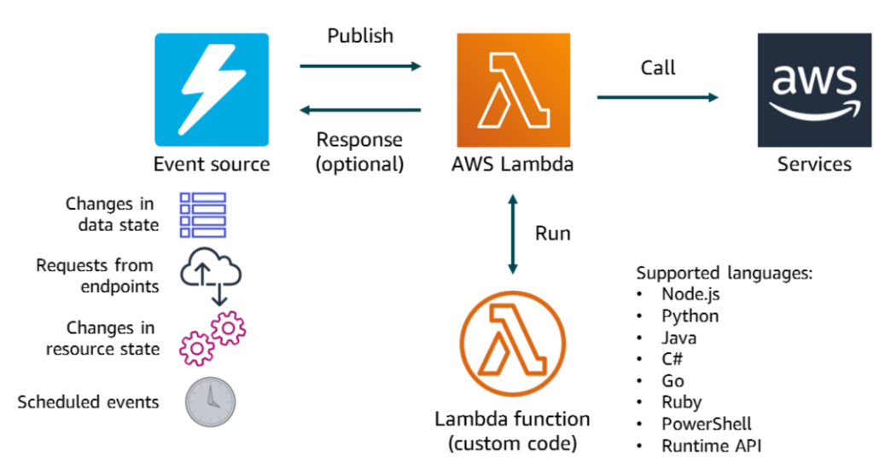
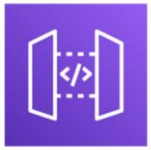
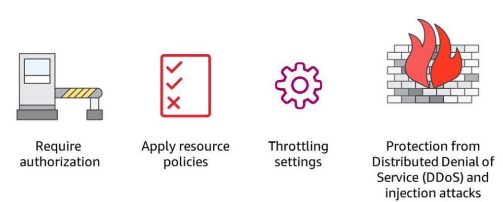
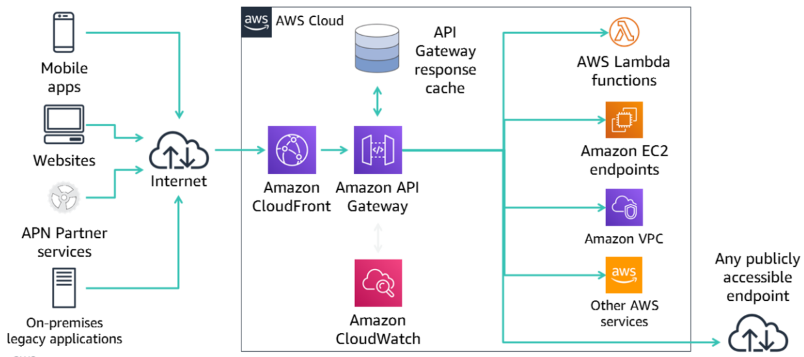
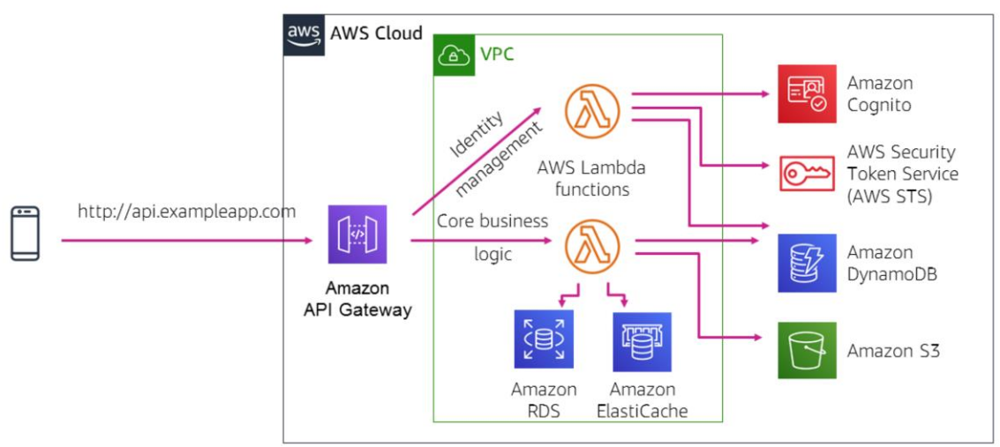

# Serverless Architecture

- Serverless is the native architecture of the cloud that enables you to shift more operational responsibilities to AWS, which can increase your agility and innovation.
- Serverless enables you to build and run applications and services without thinking about servers. Your application still runs on servers.
- However, AWS does all the server management tasks, such as server or cluster provisioning, patching, operating system maintenance, and capacity provisioning.

### Advantages of this architecture

- No infrastructure to provision or manage (no servers to provision, operate, or patch)
- Automatically scales by unit of consumption (scales by unit of work or consumption rather than by server unit)
- Pay-for-value pricing model (you pay only for the duration that a resource runs, rather than by server unit)
- Built-in availability and fault tolerance (no need to architect for availability because it is built into the service)

### AWS Serverless Offering

## AWS Lambda

- AWS Lambda is a fully managed compute service that runs your code in response to events and automatically manages the underlying compute resources for you.
- Lambda runs your code on a high-availability compute infrastructure and performs all administration of the compute resources, including server and operating system maintenance, capacity provisioning, automatic scaling, code monitoring, and logging.
- AWS Lambda natively supports Java, Go, PowerShell, Node.js, C#, Python, and Ruby code, and provides a Runtime API that enables you to use any additional programming languages to author your functions.

- Lambda@Edge is a feature of Amazon CloudFront that enables you to run code closer to users of your application, which improves performance and reduces latency. Lambda@Edge runs your code in response to events that are generated by the Amazon CloudFront content delivery network (CDN).
- Lambda@Edge enables you to run Node.js and Python Lambda functions to customize content that Amazon CloudFront delivers.

### Working of Lambda

## API Gateway

- Amazon API Gateway is a fully managed service that enables you to create, publish, maintain, monitor, and secure APIs at any scale. You can use it to create Representational State Transfer (RESTful) and WebSocket APIs that act as an entry point for applications so they can access backend resources.

- Applications can then access data, business logic, or functionality from your backend services. Such services include applications that run on Amazon EC2, code that runs on Lambda, any web application, or real-time communication applications.

- API Gateway handles all the tasks that are involved in accepting and processing up to hundreds of thousands of concurrent API calls.

- Such calls might include traffic management, authorization and access control, monitoring, and API version management. API Gateway has no minimum fees or startup costs. You pay only for the API calls you receive and the amount of data that is transferred out.

- With the API Gateway tiered-pricing model, you can reduce your cost as your API usage scales.

- You can use API Gateway to host multiple versions and stages of your APIs.

### API Gateway Security

### API Gateway Architecture Example

## Serverless Mobile Backend

