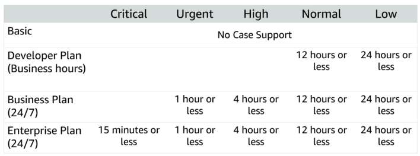

# Technical Support

### Technical Account Manager (TAM)

- If you would like proactive guidance, AWS Support has Technical Account Managers (TAMs) who are designated as that user’s primary point of contact. 
- The TAM can provide guidance, architectural review, and continuous ongoing communication to keep you informed and prepared as you plan, deploy, and optimize your solutions.

### AWS Trusted Advisor

- If you want to ensure that you follow best practices to increase performance and fault tolerance in the AWS environment, AWS Support has AWS Trusted Advisor. 

- AWS Trusted Advisor is like a customized cloud expert. 

- It is an online resource that checks for opportunities to reduce monthly 
expenditures and increase productivity. 

### AWS Support Concierge

- For account assistance, the Support Concierge is a billing and account expert who will provide quick and efficient analysis on billing and account issues. 

## AWS Support Plans

1. Basic Support
2. Developer Support
3. Business Support
4. Enterprise Support

### Case Severity and Response Time

