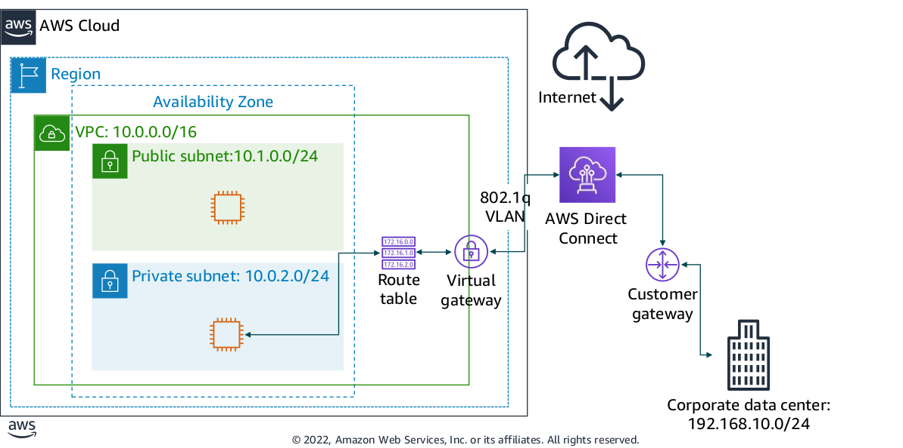

# VPC Networking

### Internet Gateway

- An internet gateway is a scalable, redundant, and highly available VPC component that allows communication between instances in your VPC and the internet.

- An internet gateway serves two purposes: 
    - to provide a target in your VPC route tables for internet-routable traffic,
    - to perform network address translation for instances that were assigned public IPv4 addresses.

- To make a subnet public, you attach an internet gateway to your VPC and add a route to the route table to send non-local traffic through the internet gateway to the internet (0.0.0.0/0).

---

### Network Address Translation

- A network address translation (NAT) gateway enables instances in a private subnet to connect to the internet or other AWS services, but prevents the internet from initiating a connection with those instances.

- To create a NAT gateway, 
    - You must specify the public subnet in which the NAT gateway should reside. 
    - You must also specify an Elastic IP address to associate with the NAT gateway when you create it. 
    - After you create a NAT gateway, you must update the route table that is associated with one or more of your private subnets to point internet-bound traffic to the NAT gateway. 
    - Thus, instances in your private subnets can communicate with the internet.

- You can also use a NAT instance in a public subnet in your VPC instead of a NAT gateway. However, a NAT gateway is a managed NAT service that provides better availability, higher bandwidth, and less administrative effort. For common use cases, AWS recommends that you use a NAT gateway instead of a NAT instance.

---

### VPC Sharing

- VPC sharing enables customers to share subnets with other AWS accounts in the same organization in AWS Organizations.

VPC sharing offers several benefits like:

1. Separation of duties : Centrally controlled VPC structure, routing, IP address allocation
2. Ownership – Application owners continue to own resources, accounts, and security groups
3. Security groups – VPC sharing participants can reference the security group IDs of each other
4. Efficiencies – Higher density in subnets, efficient use of VPNs and AWS Direct Connect
5. No hard limits – Hard limits can be avoided—for example, 50 virtual interfaces per AWS Direct Connect connection through simplified network architecture
6. Optimized costs – Costs can be optimized through the reuse of NAT gateways, VPC interface
endpoints, and intra-Availability Zone traffic.

---

### VPC Peering

- A VPC peering connection is a networking connection between two VPCs that enables you to
route traffic between them privately. 

- Instances in either VPC can communicate with each other as if they are within the same network.

- You can create a VPC peering connection between your own VPCs, with a VPC in another AWS account, or with a VPC in a different AWS Region.

- When you set up the peering connection, you create rules in your route table to allow the VPCs to communicate with each other through the peering resource.

VPC peering has some restrictions:
- IP address ranges cannot overlap.
- Transitive peering is not supported. For example, suppose that you have three VPCs: A, B, and C. VPC A is connected to VPC B, and VPC A is connected to VPC C. However, VPC B is not connected to VPC C implicitly. To connect VPC B to VPC C, you must explicitly establish that connectivity.
- You can only have one peering resource between the same two VPCs.

---

### AWS Site-to-Site VPN

- By default, instances that you launch into a VPC cannot communicate with a remote network. 

To connect your VPC to your remote network (that is, create a virtual private network or VPN
connection), you:

1. Create a new virtual gateway device (called a virtual private network (VPN) gateway) and
attach it to your VPC.
2. Define the configuration of the VPN device or the customer gateway. The customer gateway
is not a device but an AWS resource that provides information to AWS about your VPN device.
3. Create a custom route table to point corporate data center-bound traffic to the VPN gateway.
You also must update security group rules. (You will learn about security groups in the next
section.)
4. Establish an AWS Site-to-Site VPN (Site-to-Site VPN) connection to link the two systems
together.
5. Configure routing to pass traffic through the connection.

---

### AWS Direct Connect

- One of the challenges of network communication is network performance. Performance can be negatively affected if your data center is located far away from your AWS Region. For such situations, AWS offers AWS Direct Connect, or DX. 

- AWS Direct Connect enables you to establish a dedicated, private network connection between your network and one of the DX locations. 

- This private connection can reduce your network costs, increase bandwidth throughput, and provide a more consistent network experience than internet-based connections. DX uses open standard 802.1q virtual local area networks (VLANs).

---

### VPC Endpoint

- A VPC endpoint is a virtual device that enables you to privately connect your VPC to supported AWS services and VPC endpoint services that are powered by AWS PrivateLink.

- Connection to these services does not require an internet gateway, NAT device, VPN connection, or AWS Direct
Connect connection.

- Instances in your VPC do not require public IP addresses to communicate with resources in the service.

- Traffic between your VPC and the other service does not leave the Amazon network.

---

### AWS Transit Gateway

- With AWS Transit Gateway, you only need to create and manage a single connection from the central gateway into each VPC, on-premises data center, or remote office across your network. 

- A transit gateway acts as a hub that controls how traffic is routed among all the connected networks, which act like spokes. 

- This hub-and-spoke model significantly simplifies management and reduces operational costs because each network only needs to connect to the transit gateway and not to every other network. 

- Any new VPC is connected to the transit gateway, and is then automatically available to every other network that is connected to the transit gateway. This ease of connectivity makes it easier to scale your network as you grow.

### Bastion Host

- A bastion host is a server that provides access to a private network from an external network, such as the internet. 

- You can use a bastion host to minimize the chances of penetration and potential attack on resources in your private network.

- Suppose you want to allow connections from an external network to Linux instances in a private subnet of your VPC via Secure Shell, or SSH.
    - You can use a bastion host to mitigate the risk of allowing these external SSH connections to the instances in the private subnet. 
    - A bastion host typically runs on an EC2 instance in a public subnet of your VPC. 
    - The Linux instances in the private subnet are in a security group that allows SSH access from the security group attached to the bastion host. 
    - Bastion host users connect to the bastion host so they can connect to the Linux instances.

