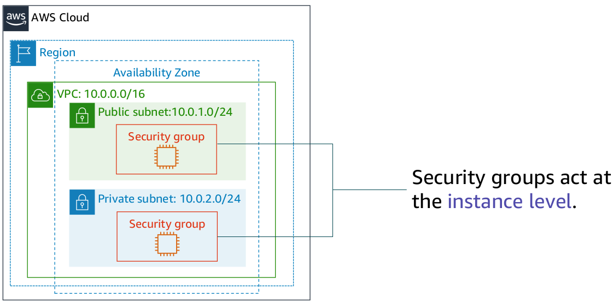
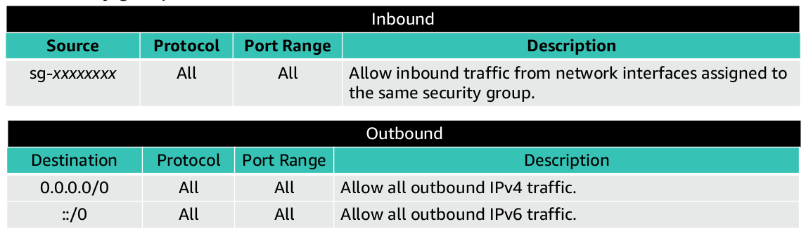
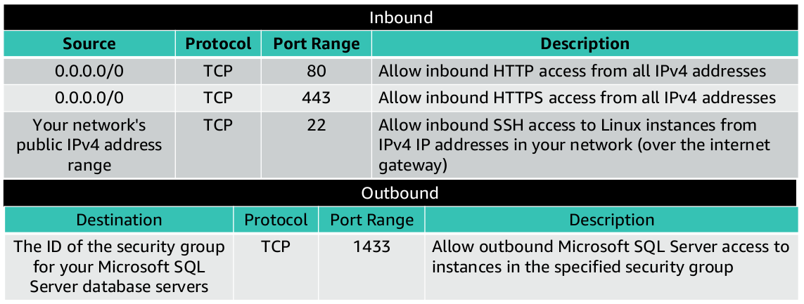
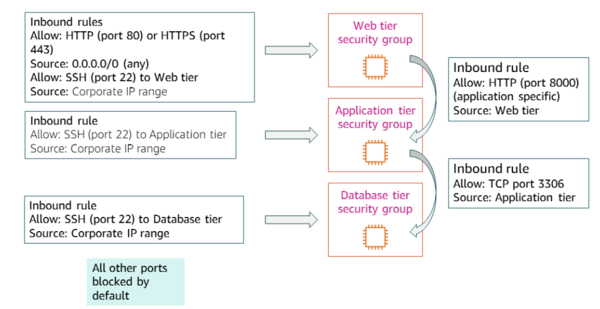
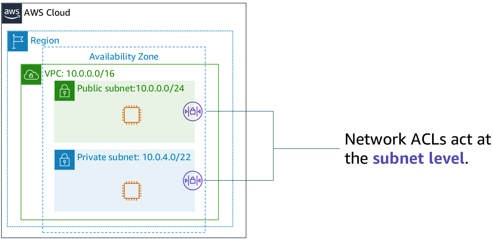
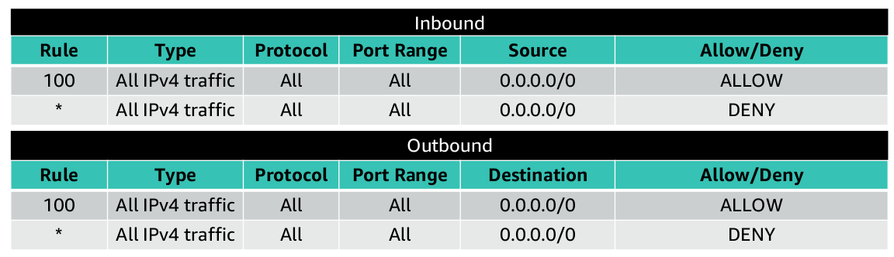
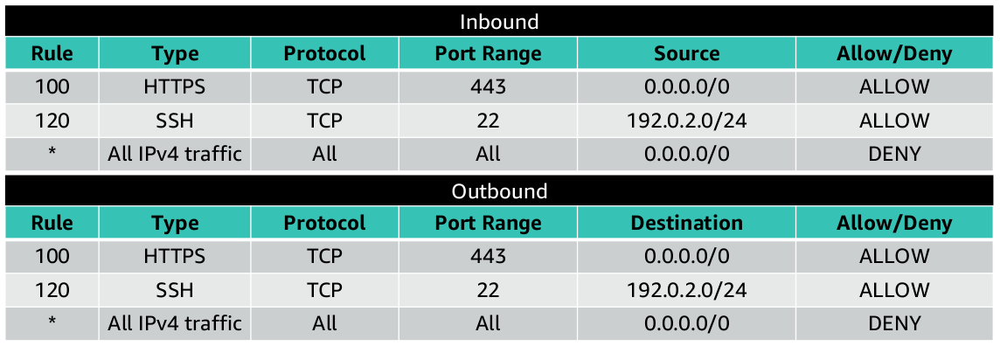
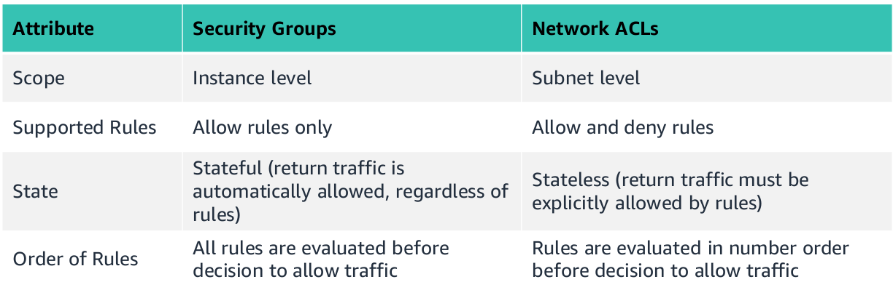

# VPC Security

Two Amazon VPC firewall options that you can use to secure your VPC

1. Security Groups
2. Network Access Control Lists (Network ACLs)

---

## Security Groups

- A security group acts as a virtual firewall for your instance, and it controls inbound and outbound traffic.

- Security groups act at the instance level, not the subnet level. Therefore, each instance in a subnet in your VPC can be assigned to a different set of security groups.

- Security groups have rules that control the inbound and outbound traffic.

- By default, there is no inbound rule.

- By default, there is an outbound rule that allows all outbound traffic.

- Security groups are stateful, which means that state information is kept even after a request is processed. Thus, if you send a request from your instance, the response traffic for that request is allowed to flow in regardless of inbound security group rules. Responses to allowed inbound traffic are allowed to flow out, regardless of outbound rules.

- You can specify allow rules, but not deny rules.

- All rules are evaluated before the decision to allow traffic.

### Chaining Security Groups

---

## Network Access Control Lists (Network ACLs)

- A network access control list (network ACL) is an optional layer of security for your Amazon VPC. 

- It acts as a firewall for controlling traffic in and out of one or more subnets. 

- To add another layer of security to your VPC, you can set up network ACLs with rules that are similar to your security groups.

- Each subnet in your VPC must be associated with a network ACL. 

- If you don't explicitly associate a subnet with a network ACL, the subnet is automatically associated with the default network ACL.

- You can associate a network ACL with multiple subnets; however, a subnet can be associated with only one network ACL at a time. 

- When you associate a network ACL with a subnet, the previous association is removed.

- A network ACL has separate inbound and outbound rules, and each rule can either allow or deny traffic.

- Default network ACLs allow all inbound and outbound IPv4 traffic.

- Network ACLs are stateless, which means that no information about a request is maintained after a request is processed.

- Custom network ACLs deny all inbound and outbound traffic until you add rules.

- You can specify both allow and deny rules.

- Rules are evaluated in number order, starting with the lowest number.

---

## Security Group VS Network ACLs

