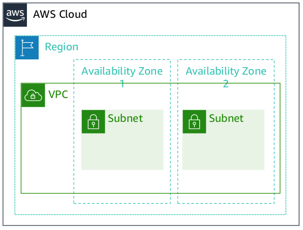
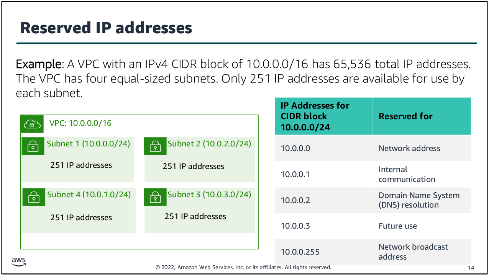
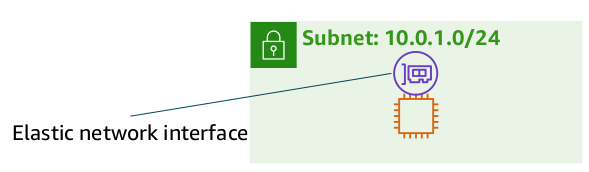
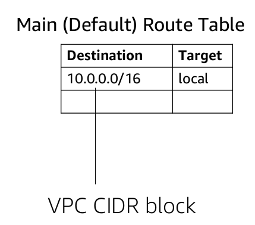

# Amazon Virtual Private Cloud

- Amazon Virtual Private Cloud (Amazon VPC) is a service that lets you provision a logically isolated section of the AWS Cloud.

- Amazon VPC gives the control over our virtual networking resources, including the selection of our own IP address range, the creation of subnets, and the configuration of route tables and network gateways.

- We can use both IPv4 and IPv6 in your VPC for secure access to resources and applications.

- We can also customize the network configuration for your VPC.

- It is logically isolated from other VPC.

- It belongs to single AWS region and can span to multiple Availability Zone.

---

### Subnets

- It is a range of IP Address that divide a VPC.

- It belongs to single availability zone.

- It is classified as public or private.

- Public subnets have direct access to the internet, but private subnets do not.

- Subnets are not isolation boundaries around your application, instead, they are containers for routing policies.

---

### IP Addressing

- When we create a VPC, we assign it to an IPv4 CIDR block.

- We can't change the address range after we create the VPC.

- The largest IPv4 CIDR block size is /16.

- The smallest IPv4 CIDR block size is /28.

- IPv6 is also supported (with a differentblock size limit).

- CIDR blocks of subnets cannot overlap.

---

### Reserved IP Address

- When you create a subnet, it requires its own CIDR block.

- For each CIDR block that you specify, AWS reserves five IP addresses within that block, and these addresses are not available for use.

- AWS reserves these IP addresses for:
    - Network address
    - VPC local router (internal communications)
    - Domain Name System (DNS) resolution
    - Future use
    - Network broadcast address

---

### Public IP Address Types

- When you create a VPC, every instance in that VPC gets a private IP address automatically.

- You can also request a public IP address to be assigned when you create the instance by modifying the subnet’s auto-assign public IP address properties.

- An Elastic IP address is a static and public IPv4 address that is designed for dynamic cloud computing.

- You can associate an Elastic IP address with any instance or network interface for any VPC in your account.

- With an Elastic IP address, you can mask the failure of an instance by rapidly remapping the address to another instance in your VPC.

- Associating the Elastic IP address with the network interface has an advantage over associating it directly with the instance.

- You can move all of the attributes of the network interface from one instance to another in a single step.

---

### Elastic Network Interface

- An elastic network interface is a virtual network interface that you can attach or detach from an instance in a VPC.

- A network interface's attributes follow it when it is reattached to another instance.

- When you move a network interface from one instance to another, network traffic is redirected to the new instance.

- Each instance in your VPC has a default network interface (the primary network interface) that is assigned a private IPv4 address from the IPv4 address range of your VPC.

- You cannot detach a primary network interface from an instance.

- You can create and attach an additional network interface to any instance in your VPC.

- The number of network interfaces you can attach varies by instance type.

---

### Route Table

- A route table contains a set of rules (or routes) that you can configure to direct network traffic from your
  subnet.

- Each route specifies a destination and a target.

- By default, every route table contains a local route for communication within the VPC.

- Each subnet must be associated with a route table (at most one).

- The main route table is the route table is automatically assigned to your VPC. It controls the routing for all subnets that are not explicitly associated with any other route table.

- A subnet can be associated with only one route table at a time, but you can associate multiple subnets with the same route table.

## VPC Design Best Practices

- Create one subnet per available Availability Zone for each group of hosts that have unique routing requirements.

- Divide your VPC network range evenly across all available Availability Zones in a Region.

- Do not allocate all network addresses at once. Instead, ensure that you reserve some address space for future use.

- Size your VPC CIDR and subnets to support significant growth for the expected workloads.

- Ensure that your VPC network range (CIDR block) does not overlap with your organization’s other private network ranges.
